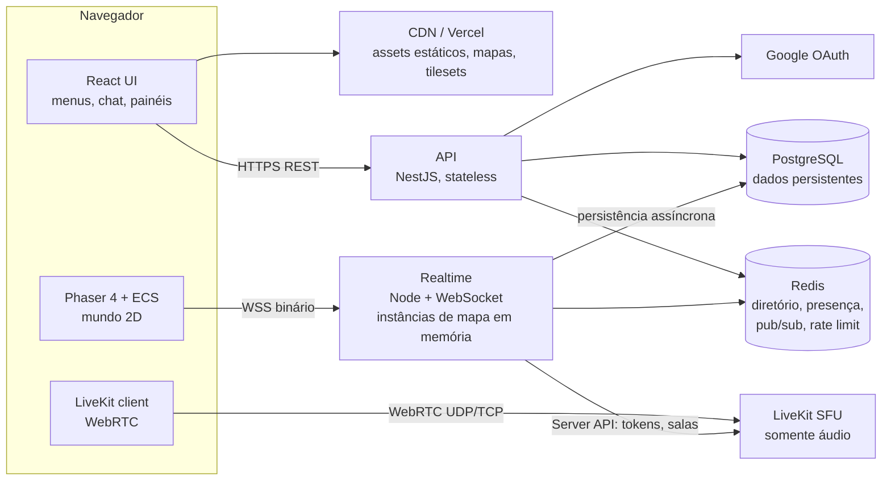
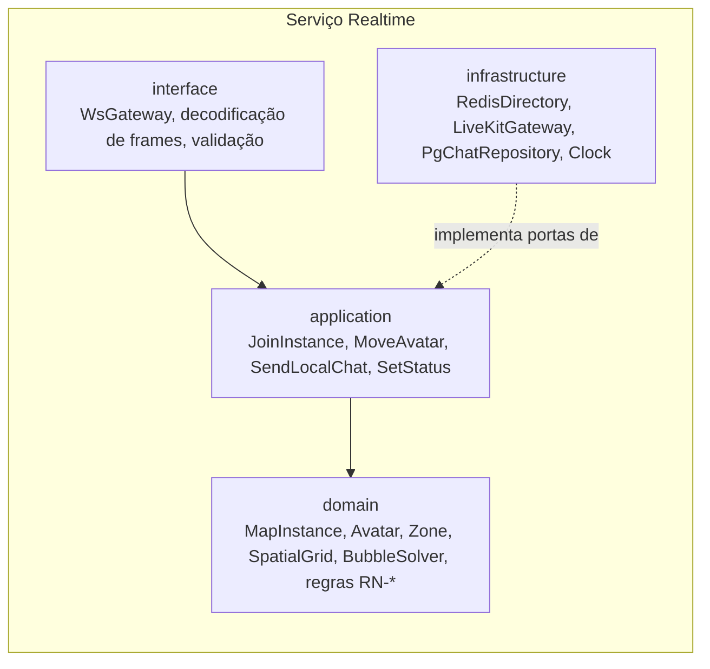
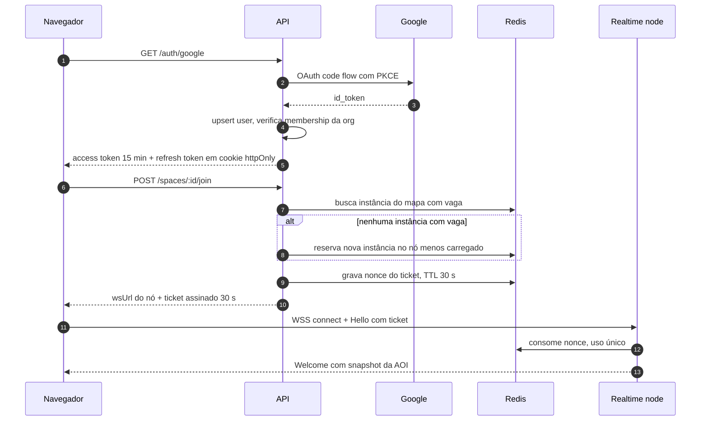
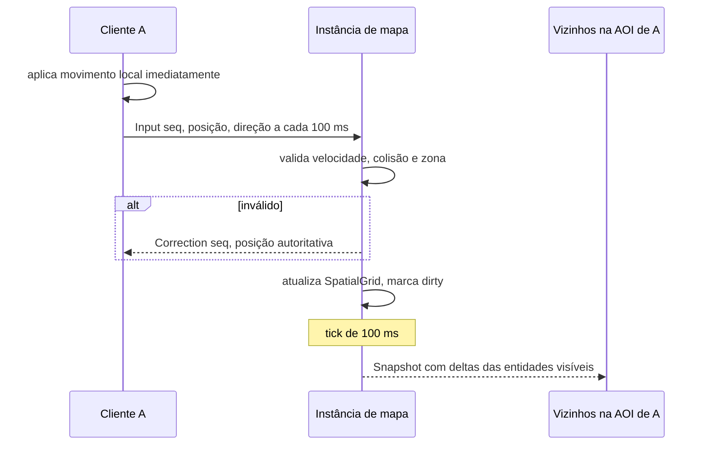
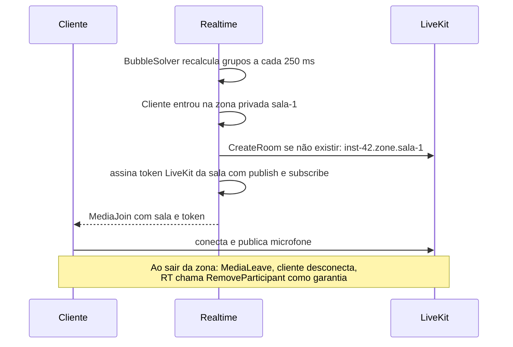
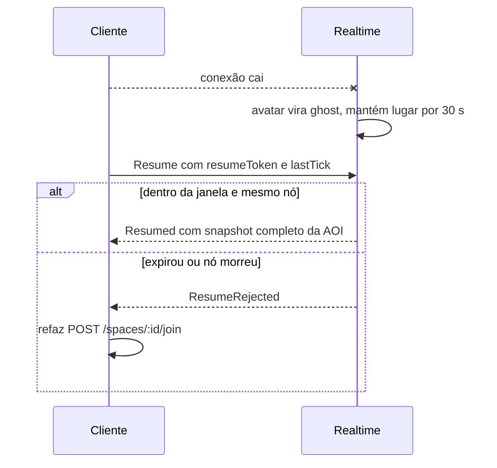
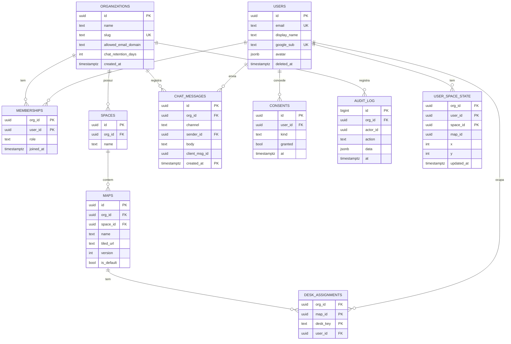

# 02 · Arquitetura

**Dono:** software-architect · **Entradas:** `00-briefing.md`, `01-roadmap.md §7` · **Status:** rascunho v1 (2026-10-06)

## 1. Drivers arquiteturais

| Driver | Meta | Fonte |
|---|---|---|
| CCU por instância de mapa | MVP 100 (carga a 150) · V1 300 | 01 §7 |
| CCU total | V1 2.000 · V2 5.000 | 01 §7 |
| Latência de movimento visível a vizinhos | p95 < 150 ms (mesma região) | 01 §7 |
| Isolamento de áudio em zona privada | **Zero vazamento** — garantido por autorização, não por cliente | 01 §3 riscos |
| Disponibilidade | MVP 99% horário comercial · V1 99,5% | 01 §7 |
| Equipe | 1 dev — minimizar peças operacionais | 00 |
| Tenancy | Multi-tenant no esquema desde o MVP | 00 |

O sistema tem **três naturezas de tráfego** com requisitos opostos, e a arquitetura separa cada uma:

1. **Request/response** (login, mapas, histórico, admin) → stateless, escala trivial.
2. **Estado de jogo em tempo real** (posições, zonas, presença local) → stateful, em memória, por instância de mapa.
3. **Mídia** (somente áudio) → WebRTC via SFU, fora do servidor de jogo.

## 2. Containers



| Container | Responsabilidade | Estado | Por que separado |
|---|---|---|---|
| **Web client** | UI React + mundo Phaser + mídia | Sessão local | Estático, servido por CDN |
| **API** | Auth, orgs, convites, espaços/mapas, histórico de chat, admin, LGPD, emissão de **ticket** para o realtime | Nenhum | Escala horizontal sem afinidade; deploy frequente sem derrubar conexões |
| **Realtime** | Hospeda instâncias de mapa: movimento, AOI, zonas, bolhas, chat local, presença local, decide quem ouve quem e emite tokens de mídia | Em memória, por instância | Conexões longas; precisa de afinidade (todos da mesma instância no mesmo processo); não pode ser serverless |
| **LiveKit SFU** | Encaminhar áudio Opus; detecção de fala | Por sala de mídia | Mídia em tempo real tem requisitos próprios de rede (UDP, TURN) e tem SLA próprio; software maduro (não reinventar) |
| **PostgreSQL** | Fonte da verdade persistente | Persistente | — |
| **Redis** | Diretório de instâncias, presença global da org, pub/sub entre nós realtime, nonces de ticket, rate limit | Efêmero (TTL) | Coordenação entre processos sem acoplar a Postgres |

**Decisão:** WebSocket puro (`ws` ou uWebSockets.js) com protocolo binário próprio no realtime, **não Socket.IO**.
Socket.IO adiciona framing, fallback de long-polling e um adapter Redis que faz broadcast entre nós — útil para chat, mas o tráfego dominante (posição) nunca deve cruzar nós. Ver ADR-0002.

## 3. Camadas (Clean Architecture)



- `domain` é TypeScript puro, sem `ws`, sem Redis, sem Nest. É onde ficam as regras do `03-mecanicas` e é 100% testável com relógio falso.
- `application` orquestra casos de uso e declara **portas** (`MediaAuthorizer`, `ChatRepository`, `PresencePublisher`).
- `infrastructure` implementa portas. Trocar LiveKit por outro SFU = nova implementação de `MediaAuthorizer`.
- A API (NestJS) segue a mesma separação: módulos Nest são a camada de interface; casos de uso e entidades não importam `@nestjs/*`.

Monorepo:

```
apps/
  client/        React + Phaser
  api/           NestJS
  realtime/      Node + ws
packages/
  protocol/      contrato cliente↔realtime (tipos + codec), versionado
  domain-rules/  parâmetros e regras puras compartilhadas (raios, velocidades)
```

## 4. Fluxos críticos

### 4.1 Login e entrada no espaço



O **ticket** é um token curto (30 s, uso único, nonce no Redis) com `userId`, `orgId`, `instanceId`, `role`. Nunca se passa o access token na URL do WebSocket (vai parar em logs de proxy).

### 4.2 Movimento



### 4.3 Entrada em bolha de áudio



**Isolamento:** zonas privadas usam **uma sala LiveKit por zona**. Só quem o realtime autorizou recebe token daquela sala, e ao sair o realtime remove o participante pela Server API. Assim o isolamento não depende do cliente se comportar.
Área aberta usa **uma sala LiveKit por região aberta da instância**, com `autoSubscribe: false`; o cliente assina apenas os tracks do seu *audible set* enviado pelo realtime. Área aberta é pública por definição (qualquer um pode andar até lá), então a assinatura seletiva no cliente é aceitável ali. Ver ADR-0003.

### 4.4 Reconexão



## 5. Estratégia de escala

### 5.1 Unidade de escala: instância de mapa

- Uma **instância** = um mapa rodando num único event loop, tick de **100 ms**. Todos os usuários da instância estão no mesmo processo → posição nunca cruza a rede interna.
- Um **nó realtime** (processo Node) hospeda várias instâncias. Um processo por vCPU (cluster por porta ou um container por vCPU).
- **Capacidade:** MVP 100–150 por instância; V1 300 (`MAX_INSTANCE_CCU`). Ao atingir o teto, a API cria outra instância do mesmo mapa (shard). Times grandes ficam juntos porque a API prefere a instância onde estão os colegas do mesmo time (V1).

### 5.2 Diretório e roteamento

Redis guarda:

```
rt:node:{nodeId}            HASH  url, cpu, ccu, lastHeartbeat   TTL 15 s
rt:instance:{instanceId}    HASH  nodeId, mapId, orgId, ccu       TTL 15 s (renovado no heartbeat)
rt:map:{mapId}:instances    ZSET  instanceId -> ccu
rt:ticket:{nonce}           STRING userId                         TTL 30 s
presence:org:{orgId}        HASH  userId -> status|instanceId|ts  (campos expiram via limpeza por heartbeat)
```

O cliente conecta **direto no nó** (`wss://rt-3.exemplo.com`). Sem load balancer com sticky session no caminho — a "afinidade" é decidida pela API. Isso elimina uma peça (e um ponto de falha).

### 5.3 O que vai pelo Redis e o que nunca vai

| Vai pelo Redis pub/sub | Nunca vai |
|---|---|
| Mudança de status de presença (visível na lista da org) | Posições, inputs, snapshots |
| Chat global da org | Chat local de bolha/zona (mesma instância) |
| Comandos administrativos (expulsar usuário, fechar instância) | Cálculo de bolhas |

### 5.4 Contas de capacidade (por instância de 300 CCU)

**Banda de saída (posição):**
- Atualização por entidade ≈ 7 bytes (ver `04-multiplayer §2`). Densidade realista: ~40 entidades na AOI, ~30% em movimento.
- Por cliente: 40 × 0,3 × 7 B × 10 Hz ≈ **0,85 KB/s**; pior caso (todos andando, 80 na AOI): 80 × 7 × 10 = **5,6 KB/s**.
- Por instância pior caso: 300 × 5,6 KB/s ≈ **1,7 MB/s** (~13 Mbps). Uma VM comum absorve.

**CPU:** por tick, validar inputs (O(1) cada) + grid AOI (O(vizinhos)) + serializar um frame por cliente. O gargalo prático é **GC e syscalls de envio**.

**Medido** (2026-10-06, `apps/realtime/scripts/load.ts`: bots andando com física válida pelo mapa Sede; servidor e bots na mesma máquina de 2 vCPU, ou seja, pessimista):

| Bots numa instância | Tick p50 | Tick p99 | Banda por cliente (mediana / p95) | Correções |
|---|---|---|---|---|
| 150 | 7,0 ms | 13,9 ms | 5,3 / 6,4 KB/s | 0 |
| 300 (sem LOD) | 22,6 ms | 47,8 ms | 12,4 / 14,4 KB/s | 37 |

**Achado:** o mapa Sede (72 × 44 tiles) cabe inteiro numa AOI de 3 × 3 células de 16 tiles, então todos veem todos e a banda cresce O(n), acima da estimativa de 0,85 KB/s. Ainda é pouco perto do áudio (~4 KB/s por peer ouvido), mas para V1: LOD por distância (implementado, −13%), células de AOI menores e mapas maiores divididos em andares. **150 por instância está validado; 300 fica no limite e precisa de máquina dedicada e novo teste.**

**Mídia:** ver `01-roadmap §2`. É o maior custo e escala com minutos em bolha, não com CCU.

### 5.5 Evolução por fase

| Fase | Topologia |
|---|---|
| MVP | 1 VM: API + Realtime + Redis em containers; Postgres gerenciado; LiveKit em VM separada ou cloud |
| V1 | API N réplicas atrás de LB; Realtime M nós com diretório no Redis; Redis gerenciado; LiveKit em cluster ou cloud |
| V2 | Workers de integração (filas) separados da API; read replica do Postgres para histórico |

Nada muda de contrato entre fases: o MVP já usa diretório no Redis e tickets, mesmo com um nó só.

## 6. Modelo de dados

### 6.1 Persistente vs. efêmero

| Dado | Onde | Justificativa |
|---|---|---|
| Usuários, orgs, membros, papéis | Postgres | Fonte da verdade |
| Espaços, mapas (metadados + URL do JSON Tiled versionado) | Postgres + CDN | JSON grande vai para storage/CDN |
| Atribuição de mesa | Postgres | Persiste entre dias |
| Chat global e de zona | Postgres (particionado por mês) | Histórico com retenção configurável |
| Chat de bolha em área aberta | **Não persistido** | Conversa de corredor; minimiza dado pessoal (LGPD) |
| Posição em tempo real | Memória da instância | Muda 10×/s |
| Última posição | Postgres, gravada ao sair | Retomar de onde parou |
| Presença | Redis com TTL | Efêmero por natureza |
| Consentimentos e auditoria | Postgres (append-only) | Prova de conformidade |

### 6.2 ERD



### 6.3 DDL do MVP

```sql
CREATE EXTENSION IF NOT EXISTS pgcrypto;
CREATE EXTENSION IF NOT EXISTS citext;

CREATE TYPE member_role AS ENUM ('owner', 'admin', 'member');

CREATE TABLE organizations (
  id                   uuid PRIMARY KEY DEFAULT gen_random_uuid(),
  name                 text NOT NULL,
  slug                 text NOT NULL UNIQUE CHECK (slug ~ '^[a-z0-9-]{3,40}$'),
  allowed_email_domain text,
  chat_retention_days  int  NOT NULL DEFAULT 90 CHECK (chat_retention_days BETWEEN 1 AND 3650),
  created_at           timestamptz NOT NULL DEFAULT now()
);

CREATE TABLE users (
  id           uuid PRIMARY KEY DEFAULT gen_random_uuid(),
  email        citext NOT NULL UNIQUE,
  google_sub   text UNIQUE,
  display_name text NOT NULL CHECK (char_length(display_name) BETWEEN 1 AND 40),
  avatar       jsonb NOT NULL DEFAULT '{"body":0,"hair":0,"outfit":0}',
  created_at   timestamptz NOT NULL DEFAULT now(),
  deleted_at   timestamptz
);

CREATE TABLE memberships (
  org_id    uuid NOT NULL REFERENCES organizations(id) ON DELETE CASCADE,
  user_id   uuid NOT NULL REFERENCES users(id) ON DELETE CASCADE,
  role      member_role NOT NULL DEFAULT 'member',
  joined_at timestamptz NOT NULL DEFAULT now(),
  PRIMARY KEY (org_id, user_id)
);
CREATE INDEX memberships_user_idx ON memberships (user_id);

CREATE TABLE spaces (
  id     uuid PRIMARY KEY DEFAULT gen_random_uuid(),
  org_id uuid NOT NULL REFERENCES organizations(id) ON DELETE CASCADE,
  name   text NOT NULL
);
CREATE INDEX spaces_org_idx ON spaces (org_id);

CREATE TABLE maps (
  id         uuid PRIMARY KEY DEFAULT gen_random_uuid(),
  org_id     uuid NOT NULL REFERENCES organizations(id) ON DELETE CASCADE,
  space_id   uuid NOT NULL REFERENCES spaces(id) ON DELETE CASCADE,
  name       text NOT NULL,
  tiled_url  text NOT NULL,
  version    int  NOT NULL DEFAULT 1,
  is_default boolean NOT NULL DEFAULT false
);
CREATE UNIQUE INDEX maps_one_default_per_space ON maps (space_id) WHERE is_default;

CREATE TABLE desk_assignments (
  org_id   uuid NOT NULL REFERENCES organizations(id) ON DELETE CASCADE,
  map_id   uuid NOT NULL REFERENCES maps(id) ON DELETE CASCADE,
  desk_key text NOT NULL,
  user_id  uuid NOT NULL REFERENCES users(id) ON DELETE CASCADE,
  PRIMARY KEY (map_id, desk_key),
  UNIQUE (map_id, user_id)            -- RN: uma mesa por pessoa por mapa
);

CREATE TABLE user_space_state (
  org_id     uuid NOT NULL REFERENCES organizations(id) ON DELETE CASCADE,
  user_id    uuid NOT NULL REFERENCES users(id) ON DELETE CASCADE,
  space_id   uuid NOT NULL REFERENCES spaces(id) ON DELETE CASCADE,
  map_id     uuid NOT NULL REFERENCES maps(id) ON DELETE CASCADE,
  x          int  NOT NULL,
  y          int  NOT NULL,
  updated_at timestamptz NOT NULL DEFAULT now(),
  PRIMARY KEY (user_id, space_id)
);

-- Particionado por mês: retenção = DROP PARTITION (barato) + DELETE fino no limite.
CREATE TABLE chat_messages (
  id            uuid NOT NULL DEFAULT gen_random_uuid(),
  org_id        uuid NOT NULL,
  channel       text NOT NULL,   -- 'global' | 'zone:{mapId}:{zoneKey}' | 'dm:{a}:{b}' (V1)
  sender_id     uuid NOT NULL,
  body          text NOT NULL CHECK (char_length(body) BETWEEN 1 AND 2000),
  client_msg_id uuid NOT NULL,
  created_at    timestamptz NOT NULL DEFAULT now(),
  PRIMARY KEY (id, created_at)
  -- Idempotência NÃO fica aqui: em tabela particionada todo UNIQUE precisa incluir created_at,
  -- e um reenvio tem created_at diferente. Dedupe por SET NX em Redis
  -- (chat:dedupe:{senderId}:{clientMsgId}, TTL 24 h) antes do INSERT. Ver 04 §6.
) PARTITION BY RANGE (created_at);
CREATE INDEX chat_channel_time_idx ON chat_messages (org_id, channel, created_at DESC);
-- Partições criadas por job mensal (ou pg_partman): chat_messages_2026_10 ...

CREATE TABLE consents (
  id      uuid PRIMARY KEY DEFAULT gen_random_uuid(),
  user_id uuid NOT NULL REFERENCES users(id) ON DELETE CASCADE,
  kind    text NOT NULL CHECK (kind IN ('microphone','terms','privacy')),
  granted boolean NOT NULL,
  version text NOT NULL,
  at      timestamptz NOT NULL DEFAULT now()
);

CREATE TABLE audit_log (
  id       bigint GENERATED ALWAYS AS IDENTITY PRIMARY KEY,
  org_id   uuid NOT NULL,
  actor_id uuid,
  action   text NOT NULL,
  data     jsonb NOT NULL DEFAULT '{}',
  at       timestamptz NOT NULL DEFAULT now()
);
CREATE INDEX audit_org_time_idx ON audit_log (org_id, at DESC);

-- RLS: defesa em profundidade. A aplicação já filtra por org; o banco garante.
-- A API abre transação e executa: SET LOCAL app.org_id = '<uuid>';
ALTER TABLE spaces            ENABLE ROW LEVEL SECURITY;
ALTER TABLE maps              ENABLE ROW LEVEL SECURITY;
ALTER TABLE desk_assignments  ENABLE ROW LEVEL SECURITY;
ALTER TABLE user_space_state  ENABLE ROW LEVEL SECURITY;
ALTER TABLE chat_messages     ENABLE ROW LEVEL SECURITY;
ALTER TABLE audit_log         ENABLE ROW LEVEL SECURITY;

CREATE POLICY tenant_isolation ON spaces
  USING (org_id = current_setting('app.org_id')::uuid);
CREATE POLICY tenant_isolation ON maps
  USING (org_id = current_setting('app.org_id')::uuid);
CREATE POLICY tenant_isolation ON desk_assignments
  USING (org_id = current_setting('app.org_id')::uuid);
CREATE POLICY tenant_isolation ON user_space_state
  USING (org_id = current_setting('app.org_id')::uuid);
CREATE POLICY tenant_isolation ON chat_messages
  USING (org_id = current_setting('app.org_id')::uuid);
CREATE POLICY tenant_isolation ON audit_log
  USING (org_id = current_setting('app.org_id')::uuid);
-- O papel da aplicação NÃO pode ser owner das tabelas nem ter BYPASSRLS.
```

## 7. Segurança

| Ameaça (STRIDE) | Vetor | Controle |
|---|---|---|
| Spoofing | Conectar no realtime como outro usuário | Ticket assinado (HS256 com segredo rotacionável), 30 s, nonce de uso único no Redis |
| Tampering | Teleporte/speed hack, entrar em sala trancada | Servidor valida velocidade máxima, colisão e permissão de zona (RN do `03`) |
| Repudiation | "Eu não expulsei ninguém" | `audit_log` append-only para ações administrativas |
| Information disclosure | Ouvir sala privada; ler chat de outra org | Sala LiveKit por zona com token emitido pelo servidor + remoção ativa; RLS por `org_id` |
| Denial of service | Flood de mensagens WS | Limite de tamanho de frame (4 KB), token bucket por conexão (inputs 20/s, chat 5/s), desconexão ao exceder repetidamente; limite de conexões por usuário (3) |
| Elevation of privilege | Membro chamando endpoint de admin | Guard de papel na API por org; papel vem do banco, nunca do cliente |

Demais controles: CSP estrita no front, cookies `httpOnly; Secure; SameSite=Lax` para refresh token, rotação de refresh token com detecção de reuso, sanitização de chat no render (texto puro, links com `rel="noopener noreferrer"`), dependências auditadas no CI.

## 8. LGPD

| Dado pessoal | Finalidade | Base legal (sugestão — validar com jurídico) | Retenção |
|---|---|---|---|
| Nome, e-mail, foto do Google | Identificação no espaço | Execução de contrato (com a empresa cliente; empresa é controladora) | Enquanto membro + 30 dias |
| Posição e presença | Funcionamento do serviço | Execução de contrato | Efêmero; última posição só até sair |
| Áudio | Comunicação | Execução de contrato + ação explícita do usuário (ligar o microfone) | **Não gravado** |
| Mensagens de chat | Comunicação | Execução de contrato | Configurável pela org (padrão 90 dias) |
| Consentimentos, auditoria | Prova de conformidade | Obrigação legal / legítimo interesse | 5 anos |

- Papéis: empresa cliente = **controladora**; seu produto = **operador**; LiveKit/cloud = **suboperadores** (listar no DPA, verificar localização dos dados — preferir região Brasil quando disponível).
- Direitos do titular: `GET /me/export` (JSON) e `DELETE /me` (anonimiza mensagens: `sender_id` → usuário "removido", apaga perfil).
- **Proibido por design:** expor a gestores tempo ativo individual, histórico de localização ou "quem conversou com quem". Métricas de uso só agregadas.

## 9. Deploy e custos

| Fase | Componente | Onde | Observação |
|---|---|---|---|
| MVP | Front | Vercel (estático) | Só o front; nada de WebSocket no Vercel |
| MVP | API + Realtime + Redis | 1 VM (Railway, Render, Fly.io, Hetzner, AWS Lightsail…) via Docker Compose | Precisa de IP/porta para WSS de longa duração |
| MVP | Postgres | Gerenciado (Neon, Supabase, RDS…) | Backups automáticos |
| MVP | LiveKit | LiveKit Cloud **ou** VM dedicada com portas UDP | Self-host exige TURN/TLS configurados |
| V1 | Realtime | N VMs ou containers com IP público por nó | Diretório no Redis já existe |
| V1 | Observabilidade | OpenTelemetry → Grafana/Prometheus ou serviço gerenciado | — |

**Custo mensal MVP (100 usuários):** `C = VM_app + PG + LiveKit + domínio`, onde LiveKit ≈ (minutos-participante × preço) no cloud ou (VM + tráfego) no self-host. Volume de mídia na `01 §2`. Todos os preços: **verificar** antes de decidir.

## 10. Observabilidade

Métricas de ouro do realtime (por instância): duração do tick (p50/p99) e *drift*; tamanho da fila de saída por conexão (backpressure); CCU; inputs rejeitados por motivo; reconexões e resumes bem-sucedidos; tempo de recálculo de bolhas. Da mídia: perda de pacote, jitter, RTT e MOS reportados pelo cliente LiveKit.
Alertas: tick p99 > 50 ms por 1 min; fila de saída > 256 KB numa conexão; taxa de resume < 90%.

## 11. Decisões candidatas a ADR

| ADR | Decisão | Contexto curto |
|---|---|---|
| 0001 | Phaser 4 como engine do cliente | Phaser 4 estável (4.2.x em jul/2026); tilemap, câmera, input e animação prontos. PixiJS exigiria construir isso |
| 0002 | WebSocket puro + protocolo binário, sem Socket.IO no realtime | Tráfego dominante é posição a 10 Hz; sem fallback de polling; controle de backpressure |
| 0003 | LiveKit como SFU; sala por zona privada + assinatura seletiva em área aberta | Mesh P2P não escala além de ~6; isolamento de zona por autorização no servidor |
| 0004 | Realtime separado da API, afinidade decidida pela API (sem sticky LB) | Deploys da API sem derrubar conexões; menos peças |
| 0005 | Movimento com predição no cliente e validação no servidor | Escritório não precisa de física autoritativa; sensação imediata |
| 0006 | Multi-tenant por `org_id` + RLS desde o MVP | Evitar migração de dados no V1 |
| 0007 | Chat de bolha não persistido | Minimização de dados (LGPD) e custo |

## 12. Para o multiplayer-engineer e o phaser-specialist

| Orçamento | Valor |
|---|---|
| Tick do servidor | 100 ms (10 Hz) |
| Envio de input do cliente | a cada 100 ms enquanto houver movimento; nada parado |
| `MAX_INSTANCE_CCU` | 150 (MVP) · 300 (V1) |
| Tamanho máximo de frame WS | 4 KB (cliente → servidor) |
| Atualização de entidade em snapshot | ≤ 8 bytes |
| Recálculo de bolhas | 250 ms |
| Janela de resume | 30 s |
| Rate limit | inputs 20/s, chat 5/s, ações 10/s por conexão |
| Conexões simultâneas por usuário | 3 (abas) — a mais nova assume o avatar, as outras viram somente leitura |
