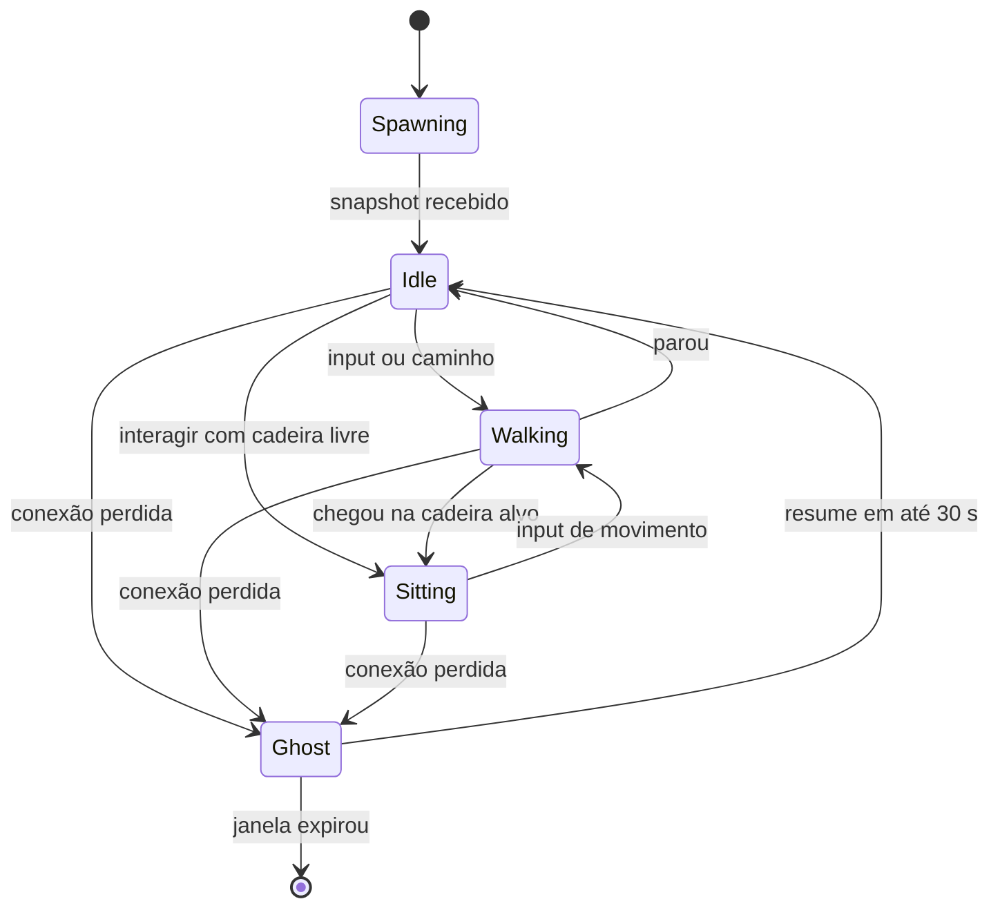

# 03 · Mecânicas do MVP

**Dono:** game-designer · **Entradas:** `01-roadmap §3 MVP`, `02-arquitetura §12` · **Status:** rascunho v1 (2026-10-06)

Princípio: **o espaço é a interface.** Para conversar, você chega perto. Para ter privacidade, você entra numa sala.
Toda regra de rede é visível no mapa. Tudo que se faz andando também se faz por menu.

## Tabela de parâmetros (fonte única)

| ID | Parâmetro | Valor MVP | Observação |
|---|---|---|---|
| P-01 | Tamanho do tile | 32 px | Render com zoom inteiro 2× (ver `06`) |
| P-02 | Velocidade de caminhada | 4 tiles/s (128 px/s) | Sem corrida (descartada no `01 §4`) |
| P-03 | Raio de **entrada** em áudio (área aberta) | 3,0 tiles | Distância euclidiana entre centros |
| P-04 | Raio de **saída** de áudio (área aberta) | 4,0 tiles | Histerese evita liga/desliga na borda |
| P-05 | Máximo de pessoas audíveis em área aberta | 8 (as mais próximas) | Acima disso, convide para uma sala |
| P-06 | Atenuação de volume | 100% até 1,5 tile → linear até 25% em P-04 | Aplicada no cliente |
| P-07 | Tolerância de velocidade no servidor | 1,25 × P-02 | Absorve jitter de rede |
| P-08 | Capacidade de sala | Propriedade `capacity` da zona (P: 4, M: 10) | Definida no mapa |
| P-09 | Ausente automático | 10 min sem input **e** sem mic ativo | Volta a Disponível no próximo input |
| P-10 | Janela de ghost após desconexão | 30 s | Igual à janela de resume (`02 §12`) |
| P-11 | Raio de interação com objeto | 1,5 tile | Prompt "E" aparece |
| P-12 | Cooldown de "Chamar colega" | 30 s por alvo | Anti-spam |
| P-13 | Expiração de chamado não respondido | 20 s | |
| P-14 | Caminho máximo do clique-para-andar | 200 tiles | Acima disso: "Ir até" com fade |
| P-15 | Recálculo de bolhas no servidor | 250 ms | `02 §12` |
| P-16 | Tamanho de mensagem de chat | 2.000 caracteres | Igual ao CHECK do banco |
| P-17 | Rate de chat | 5 mensagens/s, rajada 10 | `02 §7` |
| P-18 | Intervalo mínimo entre reações | 1,2 s por pessoa | Servidor recusa antes disso; a barra espera o mesmo tempo |
| P-19 | Duração da reação sobre o avatar | 1,8 s | Só visual, não persiste |
| P-20 | Duração do balão de fala | 6 s + 30 ms por caractere | Máximo de 90 caracteres no balão; a mensagem completa fica no chat |

## Máquina de estados do avatar

Status de presença é **ortogonal** à máquina acima (ver M4): um avatar pode estar `Sitting` e `Em reunião`.

---

## M1 · Entrada no espaço (check-in)

**Objetivo.** Fazer o início do dia parecer "chegar ao escritório": ver quem está lá e ser visto.

**Fluxo do usuário.**
1. Abre o link do espaço; se não autenticado, login Google.
2. Primeira vez: escolhe aparência (3 opções de corpo/cabelo/roupa) e confirma nome de exibição.
3. Tela de "porta": teste de microfone (desligado por padrão), contador "12 pessoas no escritório", botão **Entrar**.
4. Spawn na **última posição** do dia anterior se ainda for o mesmo dia; senão, na recepção.
5. Toast: "Bom dia, Ana. Você está na Recepção." Lista lateral mostra quem está online.

**Regras de negócio.**
- RN-M1-1: Só membros da org entram; domínio de e-mail permitido pode autoaceitar convite.
- RN-M1-2: Spawn em tile livre. Se o ponto estiver ocupado, espiral até 5 tiles; se não houver, qualquer spawn da recepção.
- RN-M1-3: Se a instância estiver lotada (`MAX_INSTANCE_CCU`), entra numa nova instância do mesmo mapa e vê aviso "Você está no Andar 1 · sala 2" (V1; no MVP o limite é alto o suficiente).
- RN-M1-4: O microfone **sempre** inicia desligado na primeira entrada; depois respeitam a última escolha do usuário (preferência local).

**Casos de uso.**
- UC-M1-1 · Colaborador · já é membro · entra e aparece na recepção.
- UC-M1-2 · Convidado novo · e-mail com domínio permitido · cria conta, escolhe avatar, entra.

**Edge cases.**
- Duas abas: a mais nova assume o avatar; a anterior mostra "Você abriu o escritório em outra aba" com botão "Usar aqui" (`02 §12`).
- Última posição dentro de sala privada trancada/lotada → spawn na porta da sala, do lado de fora.
- Mapa mudou de versão e a última posição virou parede → RN-M1-2.
- Usuário removido da org com sessão aberta → expulso no próximo heartbeat com mensagem clara.

**Critérios de sucesso.** Tempo do clique em Entrar ao avatar controlável p75 < 3 s em 4G; 0% de spawn dentro de colisão em teste automatizado de todos os spawns.

**Escala.** Entrada gera 1 snapshot da AOI (não do mapa todo): custo O(entidades na AOI).

---

## M2 · Conversa por proximidade (bolhas)

**Objetivo.** Conversa espontânea: chegar perto = começar a falar, sem link, sem agendar. É a métrica norte.

**Fluxo do usuário.**
1. Bia anda até Caio na área aberta.
2. Ao cruzar 3 tiles (P-03), um **anel suave** aparece unindo os dois avatares e um som curto toca.
3. Quem está na bolha aparece numa faixa no topo da tela (avatar + nome) com indicador de fala; o anel do avatar pulsa quando a pessoa fala.
4. Volume cai com a distância (P-06).
5. Ao se afastar além de 4 tiles (P-04), o anel some, som de saída, a pessoa sai da faixa.

**Regras de negócio.**
- RN-M2-1: Em **área aberta**, A ouve B se `dist(A,B) ≤ P-03`, e continua ouvindo enquanto `dist ≤ P-04`.
- RN-M2-2: A relação é **simétrica** (se A ouve B, B ouve A) — o servidor calcula por par, não por ouvinte.
- RN-M2-3: Cada pessoa ouve no máximo P-05 (8) pessoas, as mais próximas. Ao exceder, ela vê a dica "Muita gente aqui — que tal uma sala?".
- RN-M2-4: A "bolha" exibida é o **componente conexo** do grafo de audição — serve para o desenho do anel e para o chat local. Áudio sempre segue RN-M2-1 (você não ouve quem está no outro extremo de uma corrente de 8 pessoas).
- RN-M2-5: Quem está em **Não perturbe** não forma pares com ninguém; outros veem o anel vermelho ao redor dele e o prompt "Ana está em Não perturbe — enviar mensagem?".
- RN-M2-6: Área aberta e zona privada nunca se ouvem (ver M3).
- RN-M2-7: Paredes bloqueiam áudio: pares separados por tile de parede na linha reta entre centros não se formam (raycast na grade de colisão; custo baixo pois P-04 é pequeno).

**Casos de uso.**
- UC-M2-1 · Dois colegas se cruzam no corredor e trocam uma ideia.
- UC-M2-2 · Três pessoas na copa formam uma bolha; uma quarta se aproxima e entra.
- UC-M2-3 · Alguém quer só passar: atravessa a bolha em < 1 s — **não** entra (ver edge case de passagem).

**Edge cases.**
- **Passagem rápida**: entrar em áudio exige permanecer dentro de P-03 por **400 ms** contínuos; evita sons e conexões para quem só passa.
- Borda (pessoa oscilando em 3–4 tiles): histerese P-03/P-04 mantém o estado.
- Mais de 8 por perto: ver RN-M2-3; a nona pessoa ouve as 8 mais próximas dela, e as relações continuam simétricas porque o servidor só cria o par se ambos têm vaga (pares escolhidos por distância crescente, guloso).
- Microfone negado pelo navegador: o usuário entra na bolha (vê os outros, recebe áudio) com ícone de mic bloqueado e um link "Como permitir".
- Latência alta (> 300 ms): o anel aparece pela posição prevista local, mas o áudio só conecta quando o servidor confirmar o par (fonte da verdade = servidor).
- Desconexão de um membro: vira ghost (M1/P-10), sai do áudio imediatamente.

**Critérios de sucesso.** Produto: ≥ 3 conversas espontâneas por pessoa/dia (`01 §5`). Técnico: do cruzamento do raio ao áudio audível p95 < 1,2 s; zero pares formados atravessando parede em teste de propriedade.

**Escala.** O servidor só testa pares dentro das células vizinhas do grid (O(vizinhos)); 300 pessoas com densidade normal → poucos milhares de testes de distância a cada 250 ms. Mensagem só é enviada quando o *audible set* de alguém **muda**.

---

## M3 · Zonas privadas (salas de reunião)

**Objetivo.** Privacidade previsível: dentro da sala, todos se ouvem; fora, ninguém ouve.

**Fluxo do usuário.**
1. Usuário passa pela porta da Sala Ipê; o chão muda (tapete) e o mundo fora da sala escurece levemente.
2. Toast "Você entrou em Sala Ipê (3/10)". Áudio conecta com todos na sala, sem atenuação.
3. Chat do painel muda para "Chat da Sala Ipê".
4. Sai pela porta → volta à área aberta e às regras de M2.

**Regras de negócio.**
- RN-M3-1: Zona é um retângulo/polígono do mapa com `type=private` (ver `06`). Pertencer à zona = tile do centro do avatar dentro dela.
- RN-M3-2: Todos na mesma zona privada se ouvem, sem limite de distância e sem P-05.
- RN-M3-3: Capacidade = P-08. Com a sala cheia, o tile de porta vira colisão **para quem está fora**, com prompt "Sala cheia (10/10)".
- RN-M3-4: O servidor rejeita (Correction) movimento que entre na zona sem vaga ou sem permissão.
- RN-M3-5: Isolamento de mídia é por sala de mídia exclusiva emitida pelo servidor (`02 §4.3`). Sair da zona remove o participante ativamente.
- RN-M3-6: Status muda automaticamente para **Em reunião** ao entrar se houver ≥ 2 pessoas, e volta ao anterior ao sair (só se o usuário não mudou manualmente nesse meio tempo).
- RN-M3-7 (V1): sala trancável pelo primeiro a entrar; quem está fora pode **bater** (notificação para os de dentro, que aceitam ou não).

**Casos de uso.**
- UC-M3-1 · Daily do time na Sala Ipê.
- UC-M3-2 · 1:1 numa sala pequena (capacidade 4).

**Edge cases.**
- Duas pessoas tentam ocupar a última vaga no mesmo tick: o servidor processa inputs em ordem de chegada; a segunda recebe Correction para fora da porta e o prompt "Sala cheia".
- Pessoa desconecta dentro da sala: vira ghost por 30 s **mas libera a vaga imediatamente** (ghost não conta capacidade); se voltar e a sala encheu, faz spawn na porta, do lado de fora.
- Zona mal desenhada no mapa (sem porta) → validação do mapa no upload rejeita (ver `06`).
- Usuário arrastado para dentro por "Ir até" (M6): "Ir até" nunca leva para dentro de zona privada; leva à porta.

**Critérios de sucesso.** Zero vazamento de áudio em teste automatizado (bot fora da zona tentando assinar tracks); tempo de conexão do áudio ao entrar p95 < 1,5 s.

**Escala.** Zona é verificada só quando o avatar muda de tile (não a cada tick). Lookup O(1) por grade de zonas pré-computada (tile → zoneId).

---

## M4 · Presença e status

**Objetivo.** Saber, sem perguntar, quem está disponível para uma conversa agora.

**Fluxo do usuário.** Clica no próprio avatar ou na barra inferior → escolhe Disponível / Em reunião / Ausente / Não perturbe. A cor aparece na bolinha do nome e na lista de pessoas.

**Regras de negócio.**
- RN-M4-1: Cores: Disponível verde, Em reunião amarelo, Não perturbe vermelho, Ausente cinza (`test.txt`). Sempre acompanhadas de ícone (não depender só de cor — acessibilidade).
- RN-M4-2: Automações: Ausente após P-09; Em reunião por RN-M3-6. Status manual tem prioridade sobre automático até o usuário mudar de novo.
- RN-M4-3: Não perturbe bloqueia: formar par de áudio (RN-M2-5) e "Chamar colega" (M6). Chat continua chegando sem som.
- RN-M4-4: Presença da org (lista) é atualizada para todos da org via Redis (`02 §5.3`), com debounce de 2 s por usuário.

**Casos de uso.** UC-M4-1 · Dev focado põe Não perturbe por 2 h (V1: com expiração). UC-M4-2 · Gestor vê na lista quem está livre antes de chamar.

**Edge cases.** Duas abas com status diferentes → vale o último definido. Ausente automático durante apresentação sem tocar no teclado → mic ativo impede (P-09 exige "sem mic ativo").

**Critérios de sucesso.** Mudança de status visível para colegas p95 < 3 s. Pesquisa: ≥ 70% dizem que a lista "reflete a realidade".

**Escala.** Status muda raramente; broadcast para a org inteira é aceitável (O(membros online) por mudança, com debounce).

---

## M5 · Chat local e global

**Objetivo.** Texto como complemento do áudio: links, código, quem não pode falar agora.

**Fluxo do usuário.** Painel lateral com abas **Aqui** (bolha ou sala atual) e **Geral** (org). Enter envia; mensagem aparece com estado "enviando" → "entregue".

**Regras de negócio.**
- RN-M5-1: "Aqui" em sala privada = canal persistente da zona (`zone:{mapId}:{zoneKey}`), com histórico conforme retenção da org.
- RN-M5-2: "Aqui" em área aberta = canal efêmero da bolha (componente conexo, RN-M2-4), **não persistido** (`02 §6.1`). Quem entra na bolha vê só mensagens a partir da entrada.
- RN-M5-3: "Geral" é persistente e entregue a todos os online da org (via Redis entre nós).
- RN-M5-4: Limites P-16 e P-17. Texto puro; links clicáveis; sem HTML.
- RN-M5-5: Cada mensagem tem `clientMsgId` (UUID); reenvio com o mesmo id não duplica.
- RN-M5-6: Balão sobre o avatar por 4 s para mensagens "Aqui" (reforça presença), desligável.

**Casos de uso.** Compartilhar link durante conversa na bolha; avisar "almoço!" no Geral.

**Edge cases.** Bolha se desfaz enquanto a mensagem está em trânsito → entregue a quem estava na bolha no instante em que o servidor processou. Offline no Geral → histórico ao reconectar (últimas 50). Mensagem acima do limite → bloqueada no cliente com contador; servidor rejeita igualmente.

**Critérios de sucesso.** Entrega p95 < 500 ms na mesma instância, < 1 s entre nós. Zero duplicatas em teste com perda de pacote simulada.

**Escala.** Local = O(membros da bolha/zona). Global = O(online da org) por mensagem — aceitável com rate limit; V2 pode paginar entrega por "abas abertas".

---

## M6 · Ir até e chamar colega

**Objetivo.** Encontrar alguém num mapa grande sem procurar, e acessibilidade para quem não quer "andar".

**Fluxo do usuário.**
1. Lista de pessoas → clica em Caio → **Ir até** ou **Chamar**.
2. *Ir até*: avatar anda pelo caminho (pathfinding) se ≤ P-14; senão, fade e reaparece ao lado.
3. *Chamar*: Caio recebe som + cartão "Bia está te chamando · Ir até / Agora não". Aceitar = Caio usa "Ir até" Bia.

**Regras de negócio.**
- RN-M6-1: Destino = tile livre mais próximo a até 2 tiles do alvo, na **mesma zona** do alvo. Se o alvo está em zona privada → destino é a porta da zona.
- RN-M6-2: Fade (teleporte) é validado pelo servidor: só permitido por este comando, nunca por input de posição.
- RN-M6-3: Chamar respeita Não perturbe (botão desabilitado com tooltip) e P-12/P-13.

**Casos de uso.** Gestor chama alguém para a sala; novo colaborador encontra o buddy.

**Edge cases.** Alvo se move durante o caminho → recalcula a cada 1 s, no máximo 5 vezes; depois fade. Alvo em outra instância (V1) → "Caio está no Andar 2 · Ir até?" troca de instância. Alvo desconecta → cancela com aviso.

**Critérios de sucesso.** 100% das chegadas fora de colisão; ≥ 30% das conversas iniciadas por "Chamar" viram bolha em < 30 s.

**Escala.** Pathfinding (A* em grade) roda **no cliente**; servidor só valida passos normais. Teleporte custa um evento.

---

## M7 · Mesa e sentar

**Objetivo.** Dar "endereço" a cada pessoa e um sinal claro de "estou trabalhando".

**Fluxo do usuário.** Aproxima-se de uma cadeira (P-11) → prompt "E · Sentar". Sentado: animação `sit`, câmera centraliza levemente. Na primeira vez numa mesa livre: "Tornar esta a sua mesa?".

**Regras de negócio.**
- RN-M7-1: Cadeira é objeto do mapa com `deskKey`. Ocupação em tempo real é efêmera; **dono** da mesa é persistente (`desk_assignments`).
- RN-M7-2: Uma mesa por pessoa por mapa; mesa com dono mostra placa com nome; outros podem sentar se o dono não estiver online.
- RN-M7-3: Ao chegar o dono, quem está sentado vê "Esta é a mesa de Ana" mas não é expulso.
- RN-M7-4: Estar sentado não muda as regras de áudio: quem está a ≤ 3 tiles forma par normalmente (vizinhos de baia conversam, como num escritório real). Por isso ilhas de mesas ficam a ≥ 5 tiles umas das outras e do corredor (`06`), e quem quer foco usa Não perturbe.

**Edge cases.** Duas pessoas sentam na mesma cadeira no mesmo tick → primeiro input vence; segundo recebe Correction ao lado. Dono removido da org → mesa liberada.

**Critérios de sucesso.** ≥ 60% dos usuários ativos com mesa própria na semana 2.

**Escala.** Ocupação é estado da entidade (1 bit + deskKey) enviado só quando muda.

---

## M8 · Objetos portal (quadros, TVs)

**Objetivo.** Ferramentas existentes (Miro, Figma, Docs) "moram" em lugares do escritório.

**Fluxo do usuário.** Aproxima do quadro (P-11) → "E · Abrir Quadro do Time" → painel lateral com o site em iframe (ou nova aba se o site bloquear iframe).

**Regras de negócio.**
- RN-M8-1: Objeto com `type=portal` e `url`, configurado por admin. Só `https://`, lista de domínios permitidos por org.
- RN-M8-2: Abrir portal não muda posição nem áudio; status opcionalmente vira "Em reunião" se dentro de zona.
- RN-M8-3: Iframe com `sandbox` mínimo necessário; sem acesso ao token do app.

**Edge cases.** Site recusa iframe (X-Frame-Options) → abre em nova aba automaticamente. URL alterada por admin enquanto alguém usa → próximo clique pega a nova.

**Critérios de sucesso.** ≥ 40% dos times configuram ao menos 1 portal na semana 1.

**Escala.** Nenhum tráfego realtime; configuração vem com o mapa.

---

## M9 · Reações e balões de fala

**Objetivo.** Dar retorno rápido sem interromper quem está falando: acenar ao chegar, "joinha" numa ideia, avisar que foi pegar café. E deixar visível, no mapa, o que foi dito no chat "Aqui".

**Fluxo do usuário.** Tecla 1–6 ou clique na barra de reações → o ícone sobe sobre o avatar por P-19 para quem está na AOI. Mensagem no chat "Aqui" → balão sobre a cabeça de quem falou, para quem estava na conversa. Na copa, "E" na cafeteira mostra a reação de café.

**Regras de negócio.**
- RN-M9-1: Seis reações fixas (`wave`, `coffee`, `thumbs`, `laugh`, `heart`, `idea`). Lista fechada no protocolo: nada de texto livre, então não há moderação a fazer.
- RN-M9-2: Quem vê: a própria pessoa e quem tem o avatar na AOI (`04 §2.2`). Fantasmas (P-10) não reagem nem recebem.
- RN-M9-3: Intervalo mínimo P-18 por pessoa; antes disso o servidor responde `rate_limited` e não repassa.
- RN-M9-4: Reagir conta como atividade (tira do Ausente automático, P-09), como andar.
- RN-M9-5: O balão de fala usa a mesma audiência do chat "Aqui" (RN-M5): não cria canal novo nem amplia quem vê.
- RN-M9-6: Em Não perturbe, a pessoa ainda reage; quem está em DND continua recebendo reações de quem está perto (são silenciosas).

**Casos de uso.** Chegar na rodinha e acenar; concordar com quem está apresentando na sala sem abrir o microfone; avisar "fui ao café" com a xícara; celebrar um deploy no corredor.

**Edge cases.** Duas reações seguidas → a segunda espera (botão desabilitado por P-18; tecla repetida recebe `rate_limited`, sem aviso na tela). Pessoa sai da AOI durante a animação → o ícone some junto com o avatar. Mensagem longa → balão corta em 90 caracteres com reticências. Várias mensagens seguidas → o balão é substituído, não empilha.

**Critérios de sucesso.** ≥ 50% das pessoas ativas usam ao menos uma reação por dia na primeira semana; reação aparece para os vizinhos em < 200 ms (p95).

**Escala.** Custo O(|AOI|) por reação, sem varrer a instância. Pior caso com P-18: 150 pessoas × 0,83 reação/s × ~30 vizinhos ≈ 3,7 mil mensagens de ~40 B por segundo por instância — menor que o tráfego de snapshots.

---

## Futuro (fora do MVP, ver `01 §3`)

Auditório com modo palco (V1), salas trancáveis e "bater na porta" (V1), celebrações em grupo (V1), conquistas sem ranking de produtividade (V3), minigames na convivência (V3).

## Para o multiplayer-engineer

| Mecânica | Eventos de rede (cliente → servidor / servidor → cliente) |
|---|---|
| M1 | `Hello` / `Welcome` (snapshot AOI), `EntityEnter`, `EntityLeave` |
| M2 | `Input` / `Snapshot`; servidor → `AudibleSet` (lista de ids e fatores de volume); `MediaJoin` da sala aberta |
| M3 | servidor → `ZoneChanged`, `MediaJoin`/`MediaLeave`, `Correction` (sala cheia) |
| M4 | `SetStatus` / `PresenceChanged` |
| M5 | `ChatSend` / `ChatAck`, `ChatMessage` |
| M6 | `GoTo` (teleporte validado), `Call` / `CallReceived`, `CallResponse` |
| M7 | `Interact{sit}` / `EntityState`, `ClaimDesk` |
| M8 | nenhum (configuração no mapa) |

## Para o environment-designer

- Camada de objetos `zones` com `type ∈ {private, quiet, spawn}`, `name`, `capacity`, `key` único.
- Toda zona `private` precisa de ao menos uma porta: objeto `door` com `zoneKey`.
- Objetos `chair` com `deskKey` (mesas) ou sem (sofás, cadeiras de sala).
- Objetos `portal` com `name` e `url` padrão vazia.
- Ilhas de mesas separadas por ≥ 5 tiles (RN-M7-4); corredores ≥ 3 tiles.
- Paredes na camada de colisão bloqueiam áudio (RN-M2-7): salas precisam de paredes reais, não só tapete.
