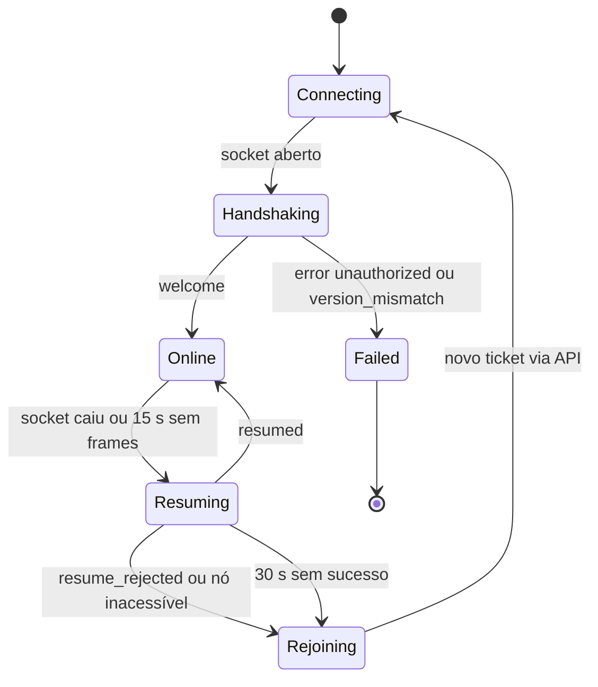
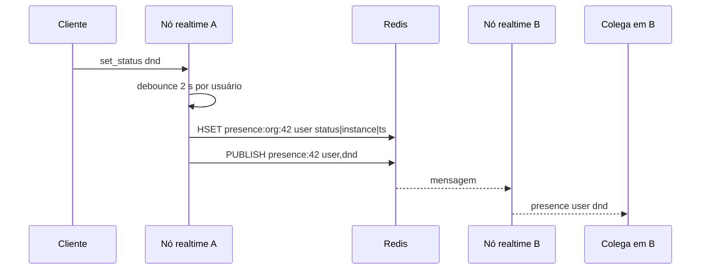
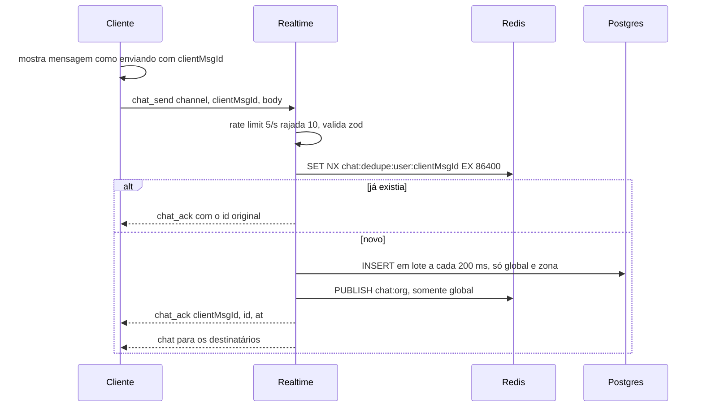

# 04 · Multiplayer — sincronização, presença, chat e áudio por proximidade

**Dono:** multiplayer-engineer · **Entradas:** `02-arquitetura §4, §5, §12`, `03-mecanicas` (P-xx, RN-*) · **Status:** rascunho v1 (2026-10-06)

**Código que acompanha este documento (compila em `strict` e tem testes).** O servidor completo está em `apps/realtime` — ver §11.

| Caminho | Conteúdo | Testes |
|---|---|---|
| `packages/protocol/src/constants.ts` | Constantes de rede e mundo (espelham P-xx e `02 §12`) | — |
| `packages/protocol/src/binary.ts` | Codec binário de Input (8 B) e Snapshot (7 + 7n B), seq com wraparound | 5 |
| `packages/protocol/src/control.ts` | Mensagens de controle JSON, validação zod do lado do servidor | 3 |
| `apps/realtime/src/domain/spatial-grid.ts` | Grid espacial para AOI e vizinhança | 1 |
| `apps/realtime/src/domain/audio-pairing.ts` | Quem ouve quem: histerese, dwell, DND, parede, grau máximo, zonas, bolhas | 10 |

## 1. Modelo de autoridade

| Aspecto | Dono | Por quê |
|---|---|---|
| Sensação de movimento | Cliente (predição local, sem esperar servidor) | Resposta imediata; escritório não tem combate |
| Posição válida | Servidor (valida velocidade, colisão, zona) | Impede teleporte, atravessar parede, invadir sala |
| Zonas, capacidade, permissões | Servidor | Regra de negócio e privacidade |
| Quem ouve quem | Servidor | Isolamento de áudio (`02 §4.3`) |
| Volume por distância | Cliente aplica o fator enviado pelo servidor | Suavização local sem tráfego extra |

O cliente envia **posições absolutas** (não teclas). Isso simplifica a reconciliação: não há replay de inputs, só aceitar ou corrigir.

## 2. Formato no fio e AOI

### 2.1 Frames

Todo frame WebSocket é binário; o 1º byte é o opcode (`Op` em `constants.ts`).

| Op | Direção | Formato | Tamanho | Frequência |
|---|---|---|---|---|
| `0x01` Input | C → S | `u8 op · u16 seq · u16 x · u16 y · u8 state` | 8 B | 10 Hz em movimento; 0 parado |
| `0x02` Snapshot | S → C | `u8 op · u16 tick · u16 ackSeq · u16 n · n × (u16 netId · u16 x · u16 y · u8 state)` | 7 + 7n B | 10 Hz, só se n > 0 |
| `0x10` Control | ambos | JSON UTF-8 (`ClientMsg` / `ServerMsg`) | ≤ 4 KB (C → S) | eventos |

`state` (1 byte): bits 0–1 direção, bit 2 andando, bit 3 sentado, bit 4 ghost.
`netId` é um `u16` por instância, atribuído no `welcome` e reciclado só após 60 s (evita confundir entidade nova com antiga em snapshots atrasados).

### 2.2 AOI (Area of Interest)

**Problema.** Broadcast de todos para todos é O(n²): 300 × 300 × 10 Hz = 900 mil atualizações/s.
**Algoritmo.** Grid uniforme de células de 16 × 16 tiles (512 px). A AOI de um cliente é o bloco 3 × 3 de células ao redor dele (1.536 px de lado — maior que a tela com zoom 2×, então nada "aparece do nada").

```
a cada tick (100 ms), por instância:
  para cada avatar com input aceito neste tick:
     mudouCelula = grid.upsert(avatar)
     se mudouCelula: marcar avatar para recálculo de AOI

  para cada avatar marcado:
     novaAoi = ids em grid.forEachInAoi(avatar.x, avatar.y)
     entraram = novaAoi − aoiAnterior   → enviar entity_enter (EntityInfo completo) para o avatar
     saíram   = aoiAnterior − novaAoi   → enviar entity_leave
     (e o simétrico: avatar entra/sai da AOI dos vizinhos)

  para cada cliente:
     itens = entidades na AOI cujo (x, y, state) difere do último ENVIADO A ESTE CLIENTE
     se itens não vazio e cliente sem backpressure:
        encodeSnapshotInto(bufferReutilizável, { tick, ackSeq: cliente.lastAcceptedSeq, itens })
        send uma vez
        atualizar últimoEnviado[cliente][entidade]
```

O delta é **por cliente em relação ao último enviado a ele**, não "dirty global". Assim, se um snapshot é pulado por backpressure, o próximo naturalmente reenvia o que mudou. Custo: O(entidades na AOI) por cliente por tick — com 300 clientes e ~80 na AOI, ~24 mil comparações de inteiros por tick.

**LOD por distância (sempre ligado):** entidades a mais de 16 tiles do cliente (≈ meia largura da tela) vão a 5 Hz; mudanças de estado (parar, sentar, ghost) saem na hora. Implementado em `MapInstance.step` e testado.

**Custo de banda medido** (`02 §5.4`): 150 numa instância do mapa Sede → 5,3 KB/s mediana, 6,4 KB/s p95 por cliente. No Sede todos estão na mesma AOI; em mapas maiores a AOI corta mais.

**Degradação.** Se o tick p99 passar de 80 ms, a API para de alocar novos usuários nesta instância.

## 3. Interpolação (entidades remotas)

**Problema.** Snapshots chegam a 10 Hz com jitter; desenhar a última posição recebida faz avatares "teleportarem" em degraus.
**Algoritmo.** Renderizar o passado: cada entidade remota tem um buffer de amostras `(serverTimeMs, x, y, state)`. O cliente desenha no instante `renderTime = serverNow − 150 ms` (`NET.INTERPOLATION_DELAY_MS`), interpolando entre as duas amostras que o cercam.

```ts
// Pseudocódigo — implementação real em apps/client/src/net/interpolation.ts
function sample(buf: Sample[], renderTime: number): { x: number; y: number } {
  // buf ordenado por t; descarta amostras mais velhas que renderTime − 1 s
  for (let i = buf.length - 1; i > 0; i--) {
    const a = buf[i - 1], b = buf[i];
    if (a.t <= renderTime && renderTime <= b.t) {
      const k = (renderTime - a.t) / (b.t - a.t);
      return { x: a.x + (b.x - a.x) * k, y: a.y + (b.y - a.y) * k };
    }
  }
  const last = buf[buf.length - 1];
  const ahead = renderTime - last.t;
  if (ahead <= 100 && buf.length >= 2) {           // extrapola no máximo 100 ms
    const prev = buf[buf.length - 2];
    const v = { x: (last.x - prev.x) / (last.t - prev.t), y: (last.y - prev.y) / (last.t - prev.t) };
    return { x: last.x + v.x * ahead, y: last.y + v.y * ahead };
  }
  return { x: last.x, y: last.y };                 // segura parado
}
```

**Relógio do servidor no cliente.** `serverNow = Date.now() + offset`. A cada `ping` (5 s): `offset_amostra = s − (c_envio + c_recebimento) / 2`; `offset = EMA(offset, amostra, α = 0,1)`, descartando amostras com RTT > 2 × mediana. O tempo de um snapshot é `tickToTime(tick)` com desdobramento do wraparound de `u16` (6.553,6 s) usando o último tick conhecido.

**Teleporte legítimo** (M6 "Ir até", spawn): distância entre amostras > 4 tiles → limpar buffer e aparecer com fade, sem interpolar atravessando paredes.

## 4. Predição e reconciliação (avatar local)

**Problema.** Esperar o servidor para mover o próprio avatar adiciona um RTT de atraso a cada tecla.
**Algoritmo.**

1. Cliente simula o próprio avatar a cada frame (colisão com a mesma grade do servidor, velocidade P-02).
2. A cada 100 ms em movimento, envia `Input{seq++, x, y, state}`. Parado, não envia nada (economia de banda).
3. Servidor valida:

```ts
// apps/realtime — caso de uso MoveAvatar (camada application)
const dt = clamp(now - av.lastAcceptedAt, 50, 1000);
const maxStep = WORLD.WALK_SPEED_PX_S * WORLD.SPEED_TOLERANCE * dt / 1000 + 4; // +4 px de folga de arredondamento
if (dist(av, input) > maxStep)                     return reject('speed');
if (!map.segmentWalkable(av.x, av.y, input.x, input.y)) return reject('collision'); // Bresenham na grade
const z = map.zoneAt(input.x, input.y);
if (z !== av.zone && z?.type === 'private' && !zones.canEnter(z, av)) return reject('zone_full');
accept(input); // atualiza posição, lastAcceptedAt, lastAcceptedSeq, grid, zona
```

4. `reject(motivo)` envia `correction{seq, x, y, reason}` com a última posição aceita, **no máximo 1 por 200 ms** por cliente. Depois de uma correção, inputs que ainda estavam em trânsito ficam longe da posição corrigida e são **descartados em silêncio** pela própria regra de velocidade (medida a partir do instante da correção). Assim que o cliente aplica a correção, seus novos inputs voltam a ser aceitos. Não há época nem replay.
5. Cliente ao receber `correction`: move o avatar para `(x, y)` com suavização de 100 ms se a diferença for < 2 tiles; senão, snap. Toca feedback discreto se `reason = zone_full` ("Sala cheia").

**Modo de falha.** Cliente adulterado andando rápido: recebe correção contínua e, após 20 correções/min, é desconectado com `kicked{abuse}` e registro em auditoria.

## 5. Conexão, heartbeat e reconexão



**Heartbeat.** Cliente envia `ping{c}` a cada 5 s; servidor responde `pong{c, s}`. Sem frame algum por 15 s → conexão morta (ambos os lados). WebSocket ping/pong do protocolo também é usado pelo servidor para detectar sockets meio abertos.

**Resume.**
- No `welcome`, o servidor entrega `resumeToken` (32 bytes aleatórios, base64url) guardado **na memória da instância** → `{netId, userId, expiresAt}`.
- Queda: o avatar vira **ghost** (bit 4 do state), sai do áudio imediatamente, libera vaga de zona (RN da M3) e fica visível por 30 s.
- Cliente tenta `resume{resumeToken, lastTick}` no mesmo `wsUrl` com backoff `0,5 s → 1 s → 2 s → 4 s` (±20% jitter).
- Sucesso → `resumed{tick, entities, resumeToken}` com **snapshot completo da AOI** (mais simples e robusto que reenviar o delta perdido). O token é rotacionado a cada resume (uso único) e o novo vai no próprio `resumed`.
- Nó morreu, token expirou ou instância fechou → `resume_rejected` (ou erro de conexão) → cliente pede novo ticket à API (`POST /orgs/:orgId/spaces/:spaceId/join`), que o coloca na instância certa.

**O que se perde numa reconexão.** Mensagens de chat "Aqui" de bolha aberta enviadas durante a queda (não persistidas por design). Chat de zona e global são recuperados por histórico.

**Deploy sem derrubar todo mundo.** Nó realtime recebe SIGTERM → para de aceitar novas instâncias no diretório → envia `kicked{shutdown}` com aviso de 10 s → clientes refazem join e caem em outro nó. Posições são salvas em `user_space_state` no shutdown.

## 6. Presença

**Problema.** A lista de pessoas da org precisa refletir status em segundos, mesmo com usuários em nós diferentes.



- Cada nó assina `presence:{orgId}` apenas das orgs que têm usuários conectados nele (assina no primeiro, cancela no último).
- Heartbeat de presença a cada 30 s por usuário renova `ts`; um job no nó remove campos com `ts` > 90 s (cobre nó que morreu sem avisar) e publica `offline`.
- A lista inicial vem da API (`GET /orgs/:id/presence` → `HGETALL`), não do WebSocket.
- Automações (P-09 Ausente, RN-M3-6 Em reunião) rodam na instância, onde o estado do avatar mora.

**Custo.** O(online da org) por mudança, com debounce. Para 2.000 online e 1 mudança/pessoa/10 min ≈ 3,3 mudanças/s × 2.000 entregas ≈ 6,7 mil mensagens pequenas/s no pior caso de uma org única gigante — aceitável; V2 pode entregar presença só a quem está com a lista aberta.

## 7. Chat

| Canal | Entrega | Persistência | Ordem |
|---|---|---|---|
| `here` em bolha aberta | membros da bolha (`bubbleOf`) no instante do processamento | não | ordem de chegada no servidor |
| `here` em zona privada | membros da zona | Postgres, canal `zone:{mapId}:{zoneKey}` | `(at, id)` |
| `global` | todos online da org via Redis `chat:{orgId}` | Postgres, canal `global` | `(at, id)` |

**Fluxo de envio.**



- **Idempotência:** `clientMsgId` (UUID gerado no cliente) + `SET NX` no Redis. Reenvio após timeout de 5 s sem ack usa o mesmo id.
- **Ordem:** o servidor define `at` (relógio do nó) e `id` (UUID v7, ordenável). O cliente insere ordenando por `(at, id)`; não depende da ordem de chegada.
- **Lote no Postgres:** um `INSERT … VALUES (…), (…)` a cada 200 ms por nó reduz round-trips; o ack só sai depois do commit (global/zona) para não confirmar o que pode se perder.
- **Segurança:** texto puro; o cliente nunca usa `innerHTML`. Links detectados por regex e renderizados como `<a rel="noopener noreferrer" target="_blank">`.

## 8. Áudio por proximidade

### 8.1 Quem ouve quem

Implementado e testado em `apps/realtime/src/domain/audio-pairing.ts`:

| Regra | Origem | Teste |
|---|---|---|
| Par novo só a ≤ 3 tiles por ≥ 400 ms | P-03, M2 edge case | "dois a 2 tiles…", "passagem rápida…" |
| Par existente até 4 tiles (histerese) | P-04 | "histerese…", "3,5 tiles sem par prévio…" |
| DND não forma par | RN-M2-5 | "DND nunca forma par" |
| Parede bloqueia | RN-M2-7 | "linha de visão bloqueada…" |
| Máx. 8 por pessoa, simétrico, mais próximos primeiro | P-05, RN-M2-2/3 | "grau máximo 8…" |
| Zona privada: todos com todos, volume 1, isolada da área aberta | RN-M3-2, RN-M2-6 | "zona privada…" |
| Bolha = componente conexo, id estável | RN-M2-4 | "bolha = componente conexo…" |
| Volume 1 até 1,5 tile → 0,25 em 4 tiles | P-06 | "volume…" |

**Custo medido** (Node 22, máquina de 2 vCPU deste ambiente, mapa 120 × 80 tiles, 70% das pessoas agrupadas em 30 pontos de encontro, 10% em zonas):

| Usuários na instância | Tempo por recálculo | % de um core (a cada 250 ms) |
|---|---|---|
| 100 | 0,28 ms | 0,11% |
| 300 | 0,83 ms | 0,33% |
| 600 | 3,9 ms | 1,6% |

O recálculo de áudio não é gargalo; o orçamento do tick fica para serialização e envio.

### 8.2 Do resultado às salas de mídia

```
a cada 250 ms, por instância:
  r = audioPairing.compute(participantes, agora)
  para cada usuário u:
     se zona(u) mudou:
        se saiu de zona privada:  enviar media_leave(sala da zona); LiveKit.RemoveParticipant(sala, u)
        se entrou em zona privada: garantir sala inst.zone.{key}; enviar media_join(token da sala da zona)
     se r.audible[u] mudou (conjunto ou volume com diferença > 0,05):
        enviar audible{peers, bubbleId}
```

- **Salas LiveKit por instância:** `{instanceId}.open` (uma sala para toda a área aberta da instância no MVP) e `{instanceId}.zone.{zoneKey}`. **O cliente fica em uma sala por vez:** ao entrar numa zona recebe `media_leave(open)` + `media_join(zona)`; ao sair, o inverso. Nunca publica o microfone em duas salas.
- **Área aberta:** cliente conecta com `autoSubscribe: false` e assina (`setSubscribed(true)`) apenas as publicações dos `userId` presentes em `audible.peers`; aplica `volume` via `GainNode`/`setVolume`. Ao sair do conjunto, `setSubscribed(false)`.
- **Zona privada:** token emitido **na entrada** (grants: `roomJoin`, `canPublish`, `canSubscribe`, sala única, TTL 10 min só para o join). Saída → `RemoveParticipant` pelo servidor, independentemente do cliente.
- **Somente áudio:** o token LiveKit restringe publicação à fonte `microphone` (`canPublishSources: [MICROPHONE]`); o servidor de mídia rejeita câmera e tela mesmo de um cliente adulterado.
- **Identidade LiveKit = `userId`.** Metadados do participante não carregam e-mail.

**Por que uma sala aberta por instância e não por bolha?** Bolhas mudam a cada poucos segundos; trocar de sala WebRTC custa renegociação (centenas de ms e um "clique" no áudio). Assinatura seletiva dentro da mesma sala é barata. Zonas privadas mudam pouco e exigem isolamento forte — aí vale a sala dedicada.

**Risco a validar no teste de carga:** sala aberta com 300 participantes gera sinalização de publicação para todos (não mídia). Se pesar, dividir a área aberta em regiões (`{instanceId}.open.{região}`) desenhadas no mapa, com sobreposição nas fronteiras.

### 8.3 Modos de falha

| Falha | Comportamento |
|---|---|
| LiveKit indisponível | Mundo e chat seguem; banner "Áudio indisponível"; reconexão com backoff |
| Permissão de microfone negada | Usuário ouve e é ouvido como "mudo"; ícone de mic bloqueado |
| Cliente demora a processar `audible` | Servidor não depende disso na área aberta (pública); na zona, a remoção ativa garante isolamento |
| Rede ruim (perda > 10%) | Opus com FEC/DTX segura até ~10–15% de perda; UI mostra indicador de conexão ruim |

## 9. Backpressure e proteção do servidor

- Antes de enviar o snapshot, checar `socket.bufferedAmount`: acima de 64 KB, **pular** o snapshot deste tick (o delta por cliente se recupera sozinho, §2.2); acima de 256 KB por 5 s, desconectar com `resume` permitido.
- Rate limit por conexão com token bucket (`RATE` em `constants.ts`); exceder repetidamente → `error{rate_limited}` e, depois, desconexão.
- Frames C → S acima de 4 KB descartados antes do parse (`parseClientControl`).
- Validação zod em todo `Control` do cliente; `Input` é validado por tamanho fixo (8 B) e por plausibilidade (§4).

## 10. Para o phaser-specialist

| O que implementar | Constante / referência |
|---|---|
| Socket binário (`binaryType = 'arraybuffer'`), despacho por `peekOp` | `binary.ts`, `control.ts` |
| Loop de envio de input a 100 ms **só em movimento** e um último input ao parar | `NET.INPUT_SEND_MS` |
| Predição local com a mesma grade de colisão do mapa | P-02, §4 |
| Aplicar `correction` com suavização < 2 tiles ou snap | §4 passo 5 |
| Buffer de interpolação de remotos com atraso de 150 ms e extrapolação ≤ 100 ms | `NET.INTERPOLATION_DELAY_MS`, §3 |
| Estimativa de relógio do servidor por ping/pong com EMA | §3 |
| Máquina de estados de conexão com resume e backoff | §5 |
| Entity enter/leave → criar/destruir entidade ECS; `entity_meta` → atualizar nome/status | §2.2 |
| `audible` e `media_*` → **repassar para a camada de mídia (fora do Phaser)** via event bus | §8.2 |

O cliente **nunca** redeclara tipos do protocolo: importa de `@cesar-office/protocol`.

## 11. Implementação do servidor (`apps/realtime`)

| Camada | Arquivos | O que faz |
|---|---|---|
| domain | `map-instance.ts`, `audio-pairing.ts`, `spatial-grid.ts` | Agregado da instância: entrada, movimento validado, zonas e capacidade, AOI + snapshots delta com LOD, ghost/resume, áudio, sentar, "Ir até", status automático |
| application | `realtime-service.ts`, `ports.ts` | Handshake por ticket, resume, chat (aqui/global, idempotente), presença, chamados, mesas, troca de sala de áudio |
| infrastructure | `ticket.ts`, `livekit-media.ts`, `memory-adapters.ts`, `system.ts` | JWT HS256 de uso único; tokens LiveKit **só microfone** + `RemoveParticipant`; adaptadores em memória (nó único); mapas do disco |
| interface | `ws-gateway.ts`, `rate-limiter.ts` | WebSocket binário, origem permitida, limite de frame, token buckets, health/metrics, tick com compensação de drift |

Testes: 25 de domínio + 11 ponta a ponta com clientes WebSocket reais (`test/e2e.test.ts`). Carga: `scripts/load.ts`.

**Contrato sutil:** `InstanceOutput.snapshot(frame)` recebe um array de entidades **reutilizado** entre clientes — o adaptador precisa codificar (ou copiar) antes de retornar. O encoder real faz isso; um dublê de teste que guardava a referência mascarou resultados e foi corrigido.

**Para vários nós (V1):** trocar `InMemoryOrgBus` por Redis pub/sub, `InMemoryNonceStore` por `SET NX EX`, `InMemoryChatStore` por Redis (dedupe) + Postgres, `InMemoryDeskRepository` por Postgres. As portas já existem; nada acima delas muda.

