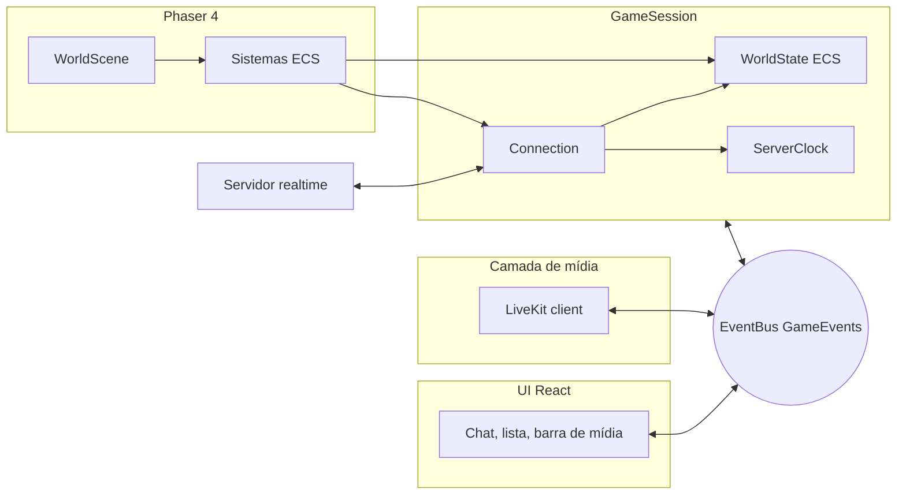

# 05 · Cliente de jogo — Phaser 4 + TypeScript + ECS

**Dono:** phaser-specialist · **Entradas:** `04-multiplayer §10`, `packages/protocol`, `06-ambientes §2` · **Status:** rascunho v1 (2026-10-06)

**Versões verificadas:** Phaser **4.2.1** (estável desde jul/2026), bitECS **0.4.0**, TypeScript 5.x.
**Estado do código:** `apps/client/src` compila com `tsc --noEmit` em `strict` + `noUncheckedIndexedAccess` + `exactOptionalPropertyTypes`; 12 testes passando (`npm test -w @cesar-office/client`); colisão, A* e leitura de mapa vivem em `packages/world` (9 testes), compartilhados com o servidor.

## 1. Princípios

1. **Phaser é a view.** Estado do mundo mora no ECS (`WorldState`), escrito pela sessão de rede mesmo antes da cena existir. Trocar Phaser por PixiJS = reescrever só `scenes/`, `input/` e `render-system.ts`.
2. **Uma direção para cada dado.** Rede → ECS → render. UI React ↔ mundo **só** pelo `EventBus<GameEvents>` tipado.
3. **Dependências por construtor.** Socket, relógio, timers e aleatoriedade são injetados — por isso `Connection`, `ServerClock`, interpolação, colisão e A* têm testes sem navegador.
4. **Nada de lógica em `Scene.update()`.** A cena compõe sistemas; cada sistema tem uma responsabilidade.

## 2. Estrutura e camadas

```
apps/client/src/
├── game.ts                      ← composição: createGame(), createBrowserSession()
├── core/
│   ├── event-bus.ts             ← bus tipado genérico
│   └── game-events.ts           ← contrato Phaser ↔ React ↔ mídia
├── session/
│   └── game-session.ts          ← application: conexão + relógio + WorldState + comandos da UI
├── net/
│   ├── connection.ts            ← máquina de estados, heartbeat, resume com backoff
│   ├── server-clock.ts          ← offset de relógio (EMA) e desdobramento de tick u16
│   ├── interpolation.ts         ← SnapshotBuffer por entidade remota
│   └── *.test.ts
├── ecs/
│   ├── components.ts            ← SoA: Position, RenderPosition, AvatarState, NetIdentity, Correction, tags
│   ├── world-state.ts           ← mundo bitECS + netId↔eid + metadados + spawn/despawn
│   └── systems/
│       ├── movement-intent.ts   ← teclado vs. caminho (PathFollower, CompositeIntent)
│       ├── local-movement-system.ts  ← predição em passo fixo + correções
│       ├── net-send-system.ts   ← input a 10 Hz só em movimento
│       ├── interpolation-system.ts   ← remotos em serverNow − 150 ms
│       └── render-system.ts     ← único que conhece GameObjects; pooling
├── world/
│   └── map-contract.ts          ← chaves de textura e profundidade (camadas Tiled vêm de @cesar-office/world)
├── media/
│   └── audio-media.ts           ← LiveKit SOMENTE ÁUDIO: uma sala por vez, assinatura pelo `audible`, volume, microfone
├── input/keyboard-intent.ts     ← setas/WASD, respeita foco do chat
└── scenes/
    ├── scene-keys.ts            ← chaves + SceneServices
    ├── boot-scene.ts            ← espera o welcome
    ├── preload-scene.ts         ← assets versionados + animações
    └── world-scene.ts           ← compõe sistemas, loop, câmera, interação
```



## 3. Gerenciamento de cenas

| Cena | Responsabilidade | Sai quando |
|---|---|---|
| `BootScene` | Esperar `world:ready` (welcome recebido) | Sessão tem `welcomeData` |
| `PreloadScene` | Carregar tilemap com chave `map-{id}-v{versão}`, tileset, avatares, fonte bitmap; criar animações | Assets prontos |
| `WorldScene` | Montar camadas, grade de colisão, interativos; criar sistemas; loop | Troca de mapa ou `destroy()` |

- Serviços (`session`, `bus`, `assetBaseUrl`) passam por `scene.start(key, data)` → `init(data)`. **Sem singletons.**
- **Troca de mapa** (V1, elevador): `session.dispose()` não é chamado; a sessão recebe novo `welcome`, e a aplicação faz `scene.start(Preload)` de novo. A chave versionada garante que o JSON novo seja carregado.
- `WorldScene` registra `SHUTDOWN` → `cleanup()`: cancela inscrições no bus, desacopla da sessão, remove listeners de input e teclas, destrói o pool de sprites. Sem isso, cada troca de mapa vaza listeners.

## 4. ECS

**Por que ECS aqui:** entidades remotas entram e saem da AOI o tempo todo; sistemas que iteram arrays contíguos (`Float32Array`) com `query()` são previsíveis em CPU e GC, e separam claramente predição (local), interpolação (remota) e render.

| Componente | Campos | Quem escreve | Quem lê |
|---|---|---|---|
| `Position` | x, y | LocalMovement (local); spawn (remoto) | NetSend, prompts, clique |
| `RenderPosition` | x, y | LocalMovement (local); Interpolation (remoto) | Render |
| `AvatarState` | packed (u8) | LocalMovement; Interpolation | NetSend, Render |
| `NetIdentity` | netId (u16) | WorldState | — |
| `Correction` | from, to, startedAt | LocalMovement.applyCorrection | LocalMovement |
| `LocalPlayer` / `RemotePlayer` | tags | WorldState | queries |

**Ordem por frame (`WorldScene.update`)**

| # | Sistema | Frequência | Notas |
|---|---|---|---|
| 1 | `LocalMovementSystem.step` | passo fixo 60 Hz, máx. 5 por frame | Eixos separados (desliza em paredes); caixa dos pés 20 × 12 px |
| 2 | `NetSendSystem.update` | todo frame, envia ≤ 10 Hz | Transições (parou, sentou) saem na hora |
| 3 | `InterpolationSystem.update` | todo frame | `serverNow − 150 ms`; marca teleportes |
| 4 | `RenderSystem.update` | todo frame | Drena spawn/despawn → pool; y-sort por `Depth.Actors + y` |

## 5. Rede no cliente

- **Connection** implementa a máquina de `04 §5`: `hello` → `welcome`; queda → `resume` com backoff `0,5/1/2/4 s ± 20%`; `resume_rejected`, janela de 30 s esgotada ou queda antes do `welcome` → `net:rejoin-required` (a app pede novo ticket à API). Testado em `connection.test.ts`.
- **Backpressure no envio:** `bufferedAmount > 64 KB` → `sendInput` retorna `false` e o `NetSendSystem` tenta no próximo frame **com a posição mais nova** (nunca acumula inputs velhos).
- **Snapshots** só são aplicados em `online`; entidade desconhecida é ignorada (o `entity_enter` sempre chega antes pelo mesmo socket ordenado).
- **Resume** traz a AOI completa: `despawnAllRemotes()` + recriação. Se a posição local divergir > 1 tile da autoritativa, teleporta.
- **Mídia não passa pelo Phaser:** `audible`, `media_join`, `media_leave` viram eventos `media:*` no bus; a camada LiveKit (React/serviço) assina.

## 6. Fronteira Phaser ↔ React

| Direção | Eventos |
|---|---|
| Mundo → UI | `net:state`, `net:rejoin-required`, `world:ready`, `world:zone`, `world:correction`, `world:interact-prompt`, `world:open-portal`, `presence:changed`, `chat:*`, `call:*`, `error`, `kicked` |
| Mundo → mídia | `media:audible`, `media:join`, `media:leave` |
| UI → mundo | `ui:set-status`, `ui:chat-send`, `ui:go-to`, `ui:call`, `ui:call-response`, `ui:interact`, `ui:focus-game` |

Regras:
- O componente React que hospeda o canvas cria `EventBus`, `GameSession` e `createGame()` num `useEffect` e chama `game.destroy()` + `session.dispose()` no cleanup.
- Estado de jogo **não** vai para estado React. A UI guarda só o que exibe (lista de pessoas, mensagens, zona atual).
- Foco: quando o input de chat ganha foco, a UI emite `ui:focus-game {focused:false}` → teclado do jogo desligado (`KeyboardIntent.setEnabled`). As teclas são registradas com `enableCapture = false` para nunca engolir digitação.

## 7. Performance (meta: 60 fps com ~100 avatares visíveis em notebook comum)

| Técnica | Onde | Efeito |
|---|---|---|
| AOI no servidor | `04 §2.2` | O cliente nunca tem mais que ~100 entidades |
| SoA + `query()` | ECS | Iteração sem alocação |
| Pooling de sprite/label/dot | `RenderSystem` | Entrar/sair da AOI não gera GC |
| `BitmapText` para nomes | `RenderSystem` | Texto sem canvas por label (Text comum custa uma textura cada) |
| Atlas único por corpo de avatar | `PreloadScene` | Menos trocas de textura → batching |
| Tilemap em camadas estáticas | `WorldScene` | Phaser renderiza só tiles visíveis da câmera |
| `pixelArt: true`, `roundPixels`, zoom inteiro 2× | `game.ts`, câmera | Nitidez sem shimmer; sem custo de filtro |
| Passo fixo com teto de 5 passos | `WorldScene.update` | Sem espiral de morte ao voltar de aba em segundo plano |
| `game.loop.sleep()` em aba oculta | `game.ts` | Economiza CPU/bateria; rede e áudio seguem |
| Sem engine de física | `game.ts` | Colisão por grade (mesma do servidor) |

Medir antes de otimizar mais: `game.loop.actualFps`, tempo de `RenderSystem.update` via `performance.mark`, e contagem de draw calls no WebGL inspector.

## 8. Checklist de produção

- [x] TypeScript estrito sem `any`; tipos de rede importados de `@cesar-office/protocol`
- [x] Sem estado global; serviços por injeção
- [x] Limpeza completa no `SHUTDOWN` da cena e no `destroy()` do jogo
- [x] Testes de unidade: interpolação, relógio, timeline de ticks, conexão/resume, colisão, A*
- [ ] Teste de integração com servidor realtime local (bots)
- [ ] Assets reais (ver `06 §7`): tileset `office-32.png`, `avatars/body-{0..2}.png` 32 × 48 com 5 colunas × 4 linhas, fonte bitmap `ui-8`, `status-dot.png`
- [ ] Telemetria: fps, RTT, correções/min, tempo até controlável
- [ ] Acessibilidade: navegação por teclado da lista de pessoas ("Ir até") e prompts de interação anunciados por `aria-live` na UI
- [ ] Bundle: Phaser como chunk separado carregado só na rota do escritório

## 8.1 App web e modo demonstração (ADR-0010)

`apps/web` (React 18 + Vite) monta o jogo e a interface: crachá de entrada, HUD (lugar, status, microfone, sair), "Na conversa", "No escritório agora" com "Ir até", e chat Aqui / Todo o escritório. O pacote do cliente é consumido por `@cesar-office/client` (`src/index.ts`).

- **Backend** (`apps/web/src/backend.ts`): `ServerBackend` entra pelo `POST /demo/join` e abre o WebSocket real; `SandboxBackend` roda o `RealtimeService` na página com bots (`src/sandbox/`).
- **Arte provisória** (`src/art/`): tileset com pisos por ambiente e paredes em 3/4 (`tiles.ts`), mobília da camada `props` (`props.ts`), avatares com contorno automático (`avatars.ts`). `createGame({ art: 'placeholder', inlineMap })` dispensa arquivos — é o que permite o build em arquivo único. Os assets reais substituem sem mudar cenas.
- **Aparência** (`AvatarLibrary`): `look.body` = tom de pele (4), `look.hair` = estilo (5) + 5 × cor (3), `look.outfit` = roupa (6). Com arte gerada, uma folha por look, criada na primeira vez que alguém com aquele look aparece; com assets, uma folha por corpo.
- **Balões e reações** (`OverheadSystem`): balão do chat "Aqui" sobre quem falou e reações (`emote_shown`) subindo sobre o avatar (`03 M9`).
- **Câmera**: zoom 1,25×–3× (roda do mouse, `+`/`−`, botões do minimapa). **Minimapa** na interface (`art/minimap.ts`): planta do mapa + pontos da AOI; clique para andar.
- **Clique em objeto**: clicar numa cadeira, quadro ou cafeteira anda até lá e usa ao chegar. Sentado, o avatar olha para a mesa (servidor e cliente usam a mesma regra).
- **Rótulos** caem para `Text` quando a fonte bitmap `ui-8` não está carregada.
- **Anel de conversa**: `WorldScene` desenha elipses sob você e sob quem você ouve, com linhas; quem fala fica verde (`media:speaking`).

## 9. Pendências

1. ~~Camada de mídia~~ — feita em `media/audio-media.ts` (somente áudio). Falta UI de seleção de dispositivo de entrada e o botão "ativar áudio" quando o navegador bloquear autoplay (`media:needs-gesture`).
2. **Balões de chat** sobre o avatar (RN-M5-6). O **anel de conversa** foi feito (§8.1); falta agrupar por `bubbleId`: usar `bubbleId` do `media:audible` — desenhar com um `Graphics` por bolha, recalculado só quando o conjunto muda.
3. **Escurecer fora da zona privada** (M3 fluxo passo 1): máscara ou retângulo com `Depth.FurnitureAbove + 1` recortando a zona atual.
4. **Clique em avatar** para abrir cartão do colega (hit area no sprite).
5. ~~Servidor realtime~~ — implementado (`04 §11`). A `WorldScene` agora lê colisão, zonas e interativos com o mesmo `loadWorldMap` do servidor.
