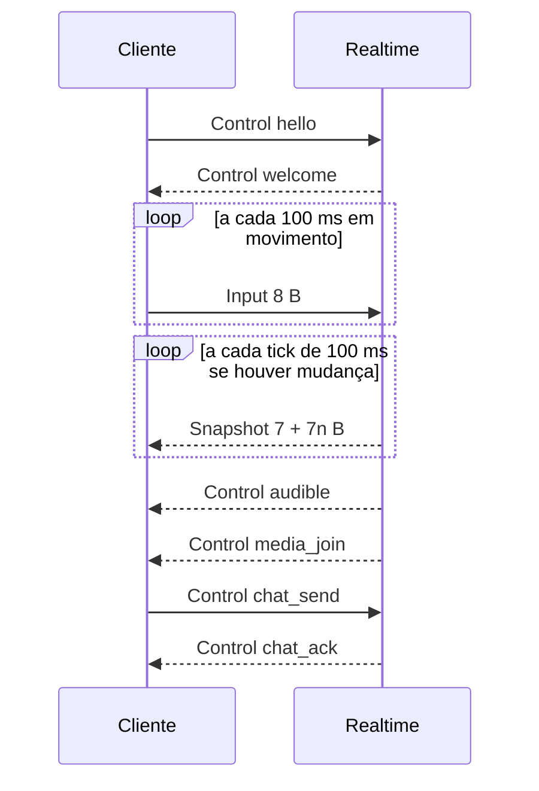

# 09 · API — REST e protocolo WebSocket

**Dono:** technical-writer · **Fontes:** `02-arquitetura §4, §7`, `packages/protocol/src` (fonte da verdade do WS) · **Status:** rascunho v1 (2026-10-06)

## 1. REST (serviço API)

Base: `https://api.<domínio>/v1` · JSON · autenticação por `Authorization: Bearer <access token>` (15 min); refresh por cookie `httpOnly`.

**Implementado em `apps/api`** (Fastify, ADR-0009), exceto o login Google e as rotas de presença, histórico de chat e auditoria, que dependem do Redis/Postgres compartilhado com o realtime. Papéis não vão no token: são lidos do banco a cada requisição, então rebaixar alguém vale na hora.
Toda rota com `:orgId` exige membership; rotas marcadas **admin** exigem papel `admin` ou `owner`.

### Erros (RFC 9457 `application/problem+json`)

```json
{ "type": "https://docs.<domínio>/errors/forbidden", "title": "Forbidden", "status": 403,
  "code": "forbidden", "detail": "Somente administradores podem convidar.", "traceId": "…" }
```

| `code` | HTTP | Quando |
|---|---|---|
| `bad_request` | 400 | Validação do corpo |
| `unauthorized` | 401 | Token ausente/expirado |
| `forbidden` | 403 | Sem papel/membership |
| `not_found` | 404 | Recurso inexistente **ou de outra org** (não vaza existência) |
| `conflict` | 409 | Mesa já tem dono, slug em uso |
| `rate_limited` | 429 | Com `Retry-After` |
| `instance_full` | 503 | Nenhuma instância com vaga (V1) |

### Autenticação e conta

| Método | Rota | Descrição |
|---|---|---|
| POST | `/auth/dev-login` | **Só desenvolvimento** (`AUTH_DEV_LOGIN=true`, proibido em produção): `{ email, displayName? }` → sessão. Some (404) quando desligado |
| GET | `/auth/google` | *Próxima etapa.* Inicia OAuth (PKCE); redireciona ao Google |
| GET | `/auth/google/callback` | *Próxima etapa.* Troca o code; cria/atualiza usuário; define cookie de refresh; redireciona ao app |
| POST | `/auth/refresh` | Lê o cookie `co_rt` (httpOnly, SameSite=Strict, path `/v1/auth`), rotaciona e devolve `{ userId, accessToken, expiresAt }`. Reusar um refresh antigo revoga a família inteira de sessões |
| POST | `/auth/logout` | Revoga refresh token |
| GET | `/me` | Perfil + memberships |
| PATCH | `/me` | `{ displayName?, avatar? }` |
| POST | `/me/consents` | `{ kind: "microphone"\|"terms"\|"privacy", granted, version }` |
| GET | `/me/export` | Exporta dados do titular (JSON) — LGPD |
| DELETE | `/me` | Exclui conta; anonimiza mensagens — LGPD |

### Organização e membros

| Método | Rota | Papel | Descrição |
|---|---|---|---|
| POST | `/orgs` | qualquer usuário | `{ name, allowedEmailDomain? }` → cria a org; quem cria vira `owner` |
| GET | `/orgs/:orgId` | membro | Dados da org |
| PATCH | `/orgs/:orgId` | admin | `{ name?, allowedEmailDomain?, chatRetentionDays? (1–3650) }` |
| GET | `/orgs/:orgId/members?cursor&limit` | membro | Lista paginada |
| POST | `/orgs/:orgId/invites` | admin | `{ emails: string[], role }` |
| PATCH | `/orgs/:orgId/members/:userId` | admin | `{ role }` |
| DELETE | `/orgs/:orgId/members/:userId` | admin | Remove; realtime expulsa com `kicked{removed_from_org}` |
| GET | `/orgs/:orgId/presence` | membro | Snapshot de presença (Redis) → `[{ userId, status, instanceId? }]` |
| GET | `/orgs/:orgId/audit?cursor` | admin | Log de auditoria |

### Espaços, mapas e entrada

| Método | Rota | Papel | Descrição |
|---|---|---|---|
| GET | `/orgs/:orgId/spaces` | membro | Espaços da org |
| POST | `/orgs/:orgId/spaces` | admin | `{ name }` → cria espaço com o mapa padrão `sede` |
| **POST** | **`/orgs/:orgId/spaces/:spaceId/join`** | membro | Escolhe instância e emite ticket (`02 §4.1`). A org vai no caminho para o RLS saber o tenant antes de qualquer consulta |
| POST | `/orgs/:orgId/spaces/:spaceId/maps` | admin | *Próxima etapa.* Upload de mapa Tiled; validado conforme `06 §2` (`loadWorldMap`) |
| PUT | `/maps/:mapId/objects/:objectKey` | admin | Configura portal `{ url }` (https, domínio na lista da org) |
| DELETE | `/maps/:mapId/desks/:deskKey` | admin | Libera mesa (reivindicar é pelo WebSocket: `claim_desk`) |

Resposta de `POST /orgs/:orgId/spaces/:spaceId/join` (`cache-control: no-store`):

```json
{
  "wsUrl": "wss://rt-3.exemplo.com/ws",
  "ticket": "eyJ…",
  "ticketExpiresAt": "2026-10-06T12:00:30Z",
  "instanceId": "inst_7Hc2",
  "mapId": "0b6f…"
}
```

### Modo demonstração (serviço Realtime, ADR-0010)

Só existem com `DEMO_MODE=true`, que é recusado em produção.

| Método | Rota | Descrição |
|---|---|---|
| POST | `/demo/join` | `{ name: 1–40 caracteres, body: 0–2 }` → `{ wsUrl, ticket }`. Ticket de convidado para a org/espaço fixos `demo_sede`. 10 por minuto por IP (`429`) |
| GET | `/maps/:mapId.json` | JSON Tiled do mapa. Servido também fora do modo demo (`MAPS_PUBLIC_URL`) |

CORS: só origens de `ALLOWED_ORIGINS` recebem `access-control-allow-origin`.

### Chat (histórico)

| Método | Rota | Descrição |
|---|---|---|
| GET | `/orgs/:orgId/chat/:channel/messages?before&limit=50` | `channel` = `global` ou `zone:{mapId}:{zoneKey}`. Só membros que estão/estiveram na zona veem histórico de zona (V1: ACL por zona) |

## 2. Protocolo WebSocket (serviço Realtime)

Fonte da verdade: `packages/protocol/src` (`PROTOCOL_VERSION = 1`). Esta seção é gerada a partir dela — **se divergir, vale o código**.

Conexão: `wss://<nó>/ws`, frames **binários**, `binaryType = 'arraybuffer'`. Primeiro byte = opcode.

### 2.1 Frames binários

| Opcode | Nome | Direção | Layout (little-endian) | Bytes |
|---|---|---|---|---|
| `0x01` | Input | C → S | `u8 op · u16 seq · u16 x · u16 y · u8 state` | 8 |
| `0x02` | Snapshot | S → C | `u8 op · u16 tick · u16 ackSeq · u16 n · n × (u16 netId · u16 x · u16 y · u8 state)` | 7 + 7n |
| `0x10` | Control | ambos | `u8 op · JSON UTF-8` | ≤ 4.096 (C → S) |

`state`: bits 0–1 direção (0 baixo, 1 esquerda, 2 direita, 3 cima) · bit 2 andando · bit 3 sentado · bit 4 ghost.

### 2.2 Control — cliente → servidor (validado com zod)

| `t` | Campos | Quando | Limite |
|---|---|---|---|
| `hello` | `v`, `ticket` | Primeiro frame | 1 |
| `resume` | `v`, `resumeToken`, `lastTick` | Primeiro frame ao reconectar | 1 |
| `ping` | `c` (relógio local) | A cada 5 s | — |
| `set_status` | `status: available\|in_meeting\|away\|dnd` | Usuário muda status | ações 10/s |
| `chat_send` | `channel: here\|global`, `clientMsgId` (UUID), `body` (1–2000) | Enviar mensagem | 5/s, rajada 10 |
| `interact` | `objectKey` | Sentar, porta | ações 10/s |
| `claim_desk` | `deskKey` | Tornar mesa sua | ações 10/s |
| `go_to` | `targetUserId` | "Ir até" | ações 10/s |
| `call` | `targetUserId` | "Chamar" | 1 por alvo a cada 30 s |
| `call_response` | `callId`, `accept` | Responder chamado | — |

### 2.3 Control — servidor → cliente

| `t` | Campos principais | Quando |
|---|---|---|
| `welcome` | `netId`, `userId`, `instanceId`, `resumeToken`, `serverTime`, `tick`, `map{mapId,version,url}`, `self{x,y}`, `entities[]` | Após `hello` válido |
| `resumed` | `tick`, `entities[]` (AOI completa), `resumeToken` (rotacionado) | Após `resume` válido |
| `resume_rejected` | `reason: expired\|unknown\|instance_gone` | Resume impossível → refazer join na API |
| `pong` | `c`, `s` (relógio do servidor) | Resposta a `ping` |
| `entity_enter` | `entity: EntityInfo` | Entidade entrou na AOI |
| `entity_leave` | `netIds[]` | Saíram da AOI |
| `entity_meta` | `netId`, `displayName?`, `status?` | Nome/status mudou |
| `presence` | `userId`, `status \| offline`, `displayName?` | Mudança de presença na org. Logo após `welcome`/`resumed`, o servidor envia um `presence` por pessoa online da org (roster inicial) |
| `correction` | `seq`, `x`, `y`, `reason: speed\|collision\|zone_full\|zone_forbidden\|teleport` | Input rejeitado ou teleporte autorizado |
| `zone` | `zoneKey \| null`, `name?`, `occupancy?`, `capacity?` | Mudou de zona |
| `audible` | `peers[{userId, volume}]`, `bubbleId` | Conjunto audível mudou |
| `media_join` | `url`, `room`, `token`, `mode: open\|zone` | Conectar a sala de mídia |
| `media_leave` | `room` | Sair de sala de mídia |
| `chat_ack` | `clientMsgId`, `id`, `at` | Mensagem aceita |
| `chat` | `id`, `channel`, `fromUserId`, `fromName`, `body`, `at` | Mensagem recebida |
| `call_received` | `callId`, `fromUserId`, `fromName`, `expiresAt` | Alguém te chamou |
| `call_result` | `callId`, `accepted` | Resposta ao seu chamado |
| `error` | `code`, `message`, `ref?` | Erro de requisição |
| `kicked` | `reason: removed_from_org\|replaced_by_new_tab\|abuse\|shutdown` | Conexão será encerrada |

`EntityInfo` = `{ netId, userId, displayName, look{body,hair,outfit}, status, x, y, state }`.

### 2.4 Sequência típica



### 2.5 Códigos de fechamento WebSocket

| Código | Significado |
|---|---|
| 1000 | Encerramento normal |
| 4000 | Heartbeat expirou (cliente) |
| 4001 | Ticket inválido/expirado |
| 4002 | Versão de protocolo incompatível |
| 4003 | Abuso / rate limit repetido |
| 4004 | Substituído por outra aba |
| 4010 | Nó em desligamento (refazer join) |
